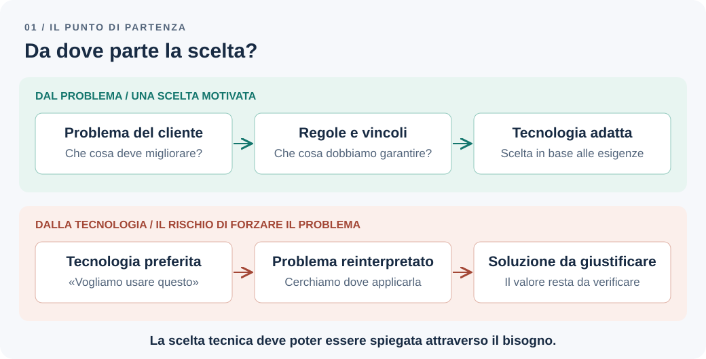
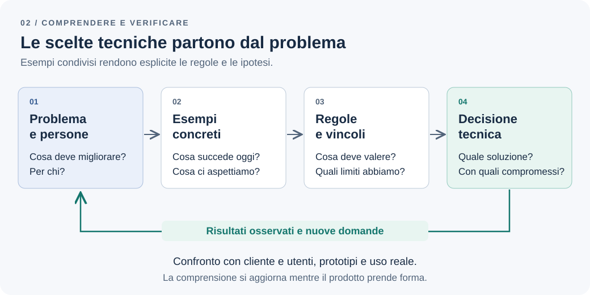

# Prima dell'architettura: capire il problema di business

«Ci serve un'applicazione per gestire le attività». Il team apre una lavagna e comincia a discutere di framework, database e servizi. Sono decisioni che prima o poi serviranno, ma la richiesta iniziale non spiega ancora quale lavoro debba migliorare, per chi e con quale risultato.

Possiamo costruire un sistema affidabile e ben organizzato che risolve il problema sbagliato. Per ridurre questo rischio, la prima parte del lavoro architetturale consiste nel capire il contesto insieme al cliente e alle persone che useranno il prodotto.

**Stiamo scegliendo la tecnologia per risolvere un problema compreso oppure stiamo adattando il problema alla tecnologia che vogliamo usare?**

*Figura 1 — Partire da una tecnologia già scelta rischia di trasformare la comprensione del problema in una ricerca di giustificazioni.*

## La richiesta iniziale non è ancora il problema

Immaginiamo un cliente che voglia una piccola applicazione Todo per il proprio gruppo di lavoro. Durante la prima conversazione chiede notifiche, una dashboard e la possibilità di creare attività senza limiti. Sono funzionalità possibili, ma manca il motivo per cui servono.

Chiedendo di raccontare una giornata recente, emerge una difficoltà: le persone iniziano molte attività e ne portano poche a termine. Il responsabile fatica a capire quali siano davvero in corso. Il risultato desiderato diventa quindi più preciso: rendere visibile il lavoro attivo e favorirne il completamento.

Questa comprensione cambia la conversazione. Una dashboard potrebbe aiutare; notifiche aggiuntive potrebbero essere irrilevanti. Prima di svilupparle, cerchiamo un modo per valutare il risultato: per esempio, osservare quante attività vengono iniziate e completate e quanto a lungo rimangono aperte. La misura va concordata e interpretata nel contesto, senza assumere che completare più attività equivalga sempre a produrre più valore.

Il cliente conosce obiettivi e vincoli che il team tecnico deve comprendere. Gli utenti conoscono il lavoro quotidiano, comprese le eccezioni che raramente compaiono nella richiesta iniziale. Quando sono persone diverse, occorre ascoltare entrambe le prospettive e chiarire chi può prendere le decisioni di prodotto.

Un approccio orientato al cliente comprende anche la capacità di discutere una richiesta: renderne espliciti costi e conseguenze, proporre alternative e verificare che contribuisca al risultato desiderato.

## Capire il lavoro prima di modellare il software

Prima di disegnare classi o tabelle, seguiamo una singola attività dall'inizio alla fine. Chi la crea? Quando comincia il lavoro? Chi può dichiararla conclusa? Cosa succede se va riaperta?

Le domande più utili chiedono fatti ed esempi:

- «Mi mostri come avete gestito l'ultima attività, dall'inizio alla fine?»
- «In quale passaggio avete perso tempo o dovuto correggere un errore?»
- «Chi decide cosa fare quando arriva un'urgenza?»
- «Cosa succede se questa operazione viene rifiutata o arriva in ritardo?»
- «Quali informazioni vi scambiate fuori dallo strumento attuale?»

Nell'esempio scopriamo che oggi “creare un'attività” può voler dire annotare un'idea oppure impegnarsi a lavorarci. Se adottiamo subito un unico stato `active`, rischiamo di confondere due momenti diversi.

Per la prima versione concordiamo un ambito ristretto: l'applicazione registrerà solo attività su cui l'utente si impegna a lavorare; la raccolta delle idee rimarrà fuori dal prodotto. Creare un todo lo renderà quindi immediatamente attivo. È una decisione di prodotto da confermare con gli utenti, non una conseguenza obbligata del modello dati.

## Far emergere le regole di business

Il cliente propone un limite per ridurre il lavoro lasciato a metà: **un utente non può avere più di tre todo attivi**. È un limite al lavoro in corso, quello che il Kanban chiama *WIP limit*: la [Kanban Guide](https://kanbanguides.org/english/) include il controllo del WIP tra le sue pratiche.

La frase sembra pronta da implementare. In realtà apre diverse domande. Perché proprio tre? Il limite è individuale o di gruppo? Un'attività bloccata conta ancora? Riaprire un'attività completata occupa un posto? Esistono eccezioni per le urgenze?

Nell'esempio concordiamo che il limite è individuale, un todo rimane attivo fino al completamento e la riapertura è consentita solo se c'è un posto disponibile. La prima versione non prevede deroghe. Il cliente conferma questa politica, mentre la sua efficacia nel migliorare il lavoro resta un'ipotesi da valutare nell'uso.

Questa distinzione è importante: **una regola può dover essere rispettata rigorosamente oggi e rimanere modificabile domani**. Il software deve impedire il quarto todo attivo anche se, in futuro, il cliente potrebbe scegliere un limite diverso.

È utile distinguere ciò che abbiamo raccolto:

| Tipo di informazione | Esempio | Conseguenza per il progetto |
| --- | --- | --- |
| Obiettivo | Ridurre il lavoro iniziato e lasciato a metà | Valutare se il prodotto migliora davvero il flusso |
| Regola concordata | Al massimo tre todo attivi per utente | Proteggere il limite in tutti i percorsi di modifica |
| Possibile politica futura | Limiti diversi per categorie di utenti | Chiarire l'esigenza prima di introdurre configurazioni |
| Preferenza di interfaccia | Mostrare il pulsante di creazione disabilitato | Aiutare l'utente a capire il limite, senza affidare alla UI la sua applicazione |
| Vincolo operativo | Un solo team mantiene e rilascia il prodotto | Considerare il costo delle soluzioni da gestire |

Non serve costruire subito un motore di regole per supportare ogni cambiamento immaginabile. Serve sapere quali decisioni sono confermate, quali sono ipotesi e chi può rivederle.

## Rendere la comprensione verificabile

Una conversazione utile deve lasciare qualcosa che cliente e sviluppatori possano rileggere e correggere insieme. Per questo caso bastano un piccolo glossario e pochi esempi. Regole, esempi e domande aperte sono anche i tre elementi dell'[Example Mapping](https://cucumber.io/blog/bdd/example-mapping-introduction/), una tecnica di Matt Wynne per esplorare una richiesta prima di implementarla. Il glossario è il primo nucleo del *linguaggio ubiquo*, di cui parliamo nel capitolo sui [bounded context](bounded-contexts.md).

Nel glossario, un **todo attivo** è un'attività creata o riaperta e non ancora completata. **Completare** libera un posto. **Riaprire** rende nuovamente attiva un'attività completata e richiede un posto disponibile.

Gli esempi rendono osservabili le conseguenze della regola:

| Situazione iniziale | Operazione | Risultato atteso |
| --- | --- | --- |
| Due todo attivi | Crearne uno | Creazione consentita; i todo attivi diventano tre |
| Tre todo attivi | Crearne uno | Creazione rifiutata; i todo attivi restano tre |
| Tre todo attivi | Completarne uno | I todo attivi diventano due |
| Tre todo attivi e uno completato | Riaprire quello completato | Riapertura rifiutata |
| Due todo attivi | Inviare due creazioni contemporanee | Una sola creazione riesce; i todo attivi diventano tre |

L'ultimo esempio fa emergere un requisito che un semplice disegno della schermata potrebbe nascondere. Il cliente può confermare il comportamento desiderato senza conoscere transazioni o lock. Spetta al team tecnico scegliere come garantirlo e come provarlo: [Dove dovrebbe finire una transazione?](transactions-eventual-consistency.md) misura alcune possibilità su PostgreSQL.

Questi esempi possono diventare criteri di accettazione e test. La loro prima funzione, però, è verificare che stiamo descrivendo lo stesso prodotto. Se il cliente si aspetta che il quarto todo venga salvato in attesa, abbiamo scoperto una differenza di modello prima di scrivere la relativa persistenza.

## Dalle regole alle decisioni architetturali

Ora abbiamo elementi per discutere di architettura. Il limite riguarda il ciclo di vita dei todo: la responsabilità di applicarlo deve stare nella parte del sistema che governa creazione e riapertura. Deve valere per l'interfaccia web, per eventuali importazioni e per qualsiasi altro ingresso.

L'esempio delle richieste contemporanee richiede inoltre un meccanismo di coordinamento: un controllo nell'interfaccia utente non basta. La scelta concreta dipenderà dalla persistenza e dai vincoli del sistema; il [prossimo capitolo](modular-monolith.md) mostrerà una possibile soluzione con PostgreSQL.

*Figura 2 — La comprensione orienta le scelte tecniche; l'uso del prodotto e gli esperimenti permettono di rivederla.*

La regola dei tre todo, da sola, non ci dice quanti servizi distribuire o quale framework usare. Per queste decisioni servono altre informazioni: volumi attesi, disponibilità necessaria, competenze del team, tempi di consegna e frequenza dei rilasci. Anche qui chiediamo conseguenze concrete: cosa comporterebbe un'ora di indisponibilità? Quali operazioni devono rispondere rapidamente, e per chi?

Supponiamo che un solo team gestisca l'applicazione, che il carico iniziale sia contenuto e che non servano rilasci indipendenti. Un'applicazione unica con responsabilità chiare è allora un punto di partenza ragionevole. Possiamo spiegare la scelta collegandola ai vincoli emersi, e indicare quali cambiamenti ci porterebbero a riconsiderarla: il capitolo sul monolite modulare ne elenca alcuni tra i [segnali per rivedere la decisione](modular-monolith.md#la-decisione-e-i-segnali-per-rivederla).

## Quanto capire prima di iniziare

L'obiettivo non è conoscere ogni requisito prima di scrivere codice. Il tempo dedicato alla comprensione ha un costo, e alcune domande trovano risposta solo quando le persone provano qualcosa di concreto.

Conviene chiarire per prime le incertezze che possono cambiare decisioni costose. Sapere se il limite è per utente o per gruppo cambia il modello e il punto di coordinamento. Scegliere il colore del contatore può aspettare. Se un dubbio riguarda fattibilità o prestazioni, un piccolo esperimento tecnico può dare informazioni migliori di un'altra riunione.

Per il nostro prodotto, una prima parte funzionante potrebbe includere creazione, completamento e rifiuto del quarto todo. La mostriamo agli utenti e osserviamo se il comportamento è comprensibile e utile. Potremmo scoprire che manca un modo per distinguere il lavoro bloccato, oppure che il limite provoca aggiramenti e non aiuta a completare le attività.

In quel caso rivediamo le ipotesi con il cliente. Averle rese esplicite permette di capire cosa stiamo cambiando e perché.

Per mantenere leggero questo lavoro bastano una descrizione del problema, gli esempi condivisi e un breve elenco di domande aperte con una persona responsabile della risposta. Documentazione e incontri aggiuntivi devono aiutare a prendere una decisione o ridurre un'incertezza concreta.

## La decisione: partire dal minimo che abbiamo compreso

Al termine di questo primo confronto, possiamo registrare una decisione iniziale:

- **Problema:** troppe attività iniziate e lasciate a metà; poca visibilità sul lavoro attivo.
- **Ambito:** gestire gli impegni in corso, lasciando fuori dalla prima versione la raccolta delle idee.
- **Regole confermate:** massimo tre todo attivi per utente; completare libera un posto; creare e riaprire richiedono un posto disponibile, anche con richieste concorrenti.
- **Ipotesi da verificare:** il limite aiuta gli utenti a completare il lavoro; il flusso scelto copre le situazioni quotidiane più frequenti.
- **Vincoli iniziali:** un team, carico contenuto e rilascio comune.
- **Alternative considerate:** servizi separati fin dall'inizio; un'applicazione unica senza confini interni.
- **Compromessi accettati:** un solo deployment, quindi si scala l'intera applicazione e i rilasci sono comuni; in cambio, meno componenti da gestire.
- **Scelta tecnica:** partire da una sola applicazione con responsabilità esplicite e verificare una piccola parte funzionante con cliente e utenti.

Il valore di questo lavoro è poter collegare una scelta tecnica a un'esigenza e riconoscere quando le sue premesse cambiano. L'architettura diventa una decisione spiegabile, aperta alla verifica. Un elenco di questo tipo è, in forma leggera, un *Architecture Decision Record*: [Michael Nygard](https://www.cognitect.com/blog/2011/11/15/documenting-architecture-decisions) lo descrive con stato, contesto, decisione e conseguenze, e conviene tenerlo nel repository, accanto al codice che motiva.

Da qui nasce la domanda del prossimo capitolo: per proteggere queste responsabilità servono servizi indipendenti oppure basta un monolite con confini più chiari?

---

[Capitolo successivo: Quando basta un monolite modulare](modular-monolith.md)

[Torna all'indice dei capitoli](../README.md#capitoli)
