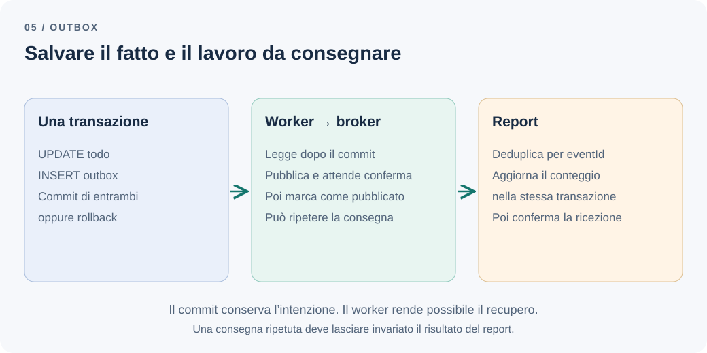

# Perché salvare dati e pubblicare un evento è difficile

L'utente completa un todo e riceve una conferma. Il database contiene la modifica, ma il sistema di report non la riceve: il processo si è arrestato un istante prima di inviare il messaggio. Riavviare l'applicazione non basta, perché nessuno ha registrato che quel messaggio doveva ancora partire.

Nel [capitolo precedente](domain-vs-integration-events.md) abbiamo definito il contratto `todo.completed.v1`. Ora dobbiamo rendere affidabile il passaggio dal salvataggio alla comunicazione esterna.

**Come colleghiamo una transazione del database a un sistema di messaggistica affidabile?**

## Il problema: due scritture, due esiti

Todo conserva lo stato in PostgreSQL. Report conta i completamenti ricevuti attraverso un broker, accettando un ritardo ma non la loro perdita definitiva. Il percorso più immediato sembra questo:

```ts
await completeTodoInDatabase(command);
await broker.publish(event);
```

Le due chiamate non costituiscono un'operazione atomica. Se la seconda fallisce, il todo rimane completato. Restituire un errore HTTP non annulla la modifica; ripetere la richiesta può non produrre un nuovo evento, perché il todo risulta già completato.

Invertire le chiamate cambia il guasto: Report potrebbe contare un completamento che il database non ha mai confermato. Anche pubblicare dentro la callback di una transazione locale lascia aperta questa possibilità: il broker non partecipa automaticamente al rollback di PostgreSQL.

| Punto di interruzione | Stato del todo | Conseguenza |
| --- | --- | --- |
| Dopo il commit, prima della pubblicazione | Completato | Report perde il fatto se manca una registrazione durevole |
| Dopo la pubblicazione, prima di un commit fallito | Ancora attivo | Report conta un fatto non confermato |
| Dopo l'accettazione del broker, prima della risposta al produttore | Completato | Il produttore non sa se riprovare causerà un duplicato |

Un `try/catch` aiuta a osservare l'errore quando il processo è vivo. Non conserva il lavoro attraverso un arresto.

## La soluzione più semplice dipende dal requisito

Per mostrare i todo attualmente completati basta una query. Per un effetto locale nello stesso database può bastare aggiornare entrambe le tabelle nella stessa transazione. Prima di aggiungere un broker, verificherei queste possibilità.

Il nostro report conta però le transizioni: completare, riaprire e completare di nuovo produce due fatti. Lo stato corrente non consente di ricostruirli. Inoltre l'indisponibilità di Report non deve bloccare il completamento dei todo.

Occorre quindi conservare il lavoro da consegnare. Il [Transactional Outbox descritto da Chris Richardson](https://microservices.io/patterns/data/transactional-outbox.html) registra il messaggio insieme alla modifica di business, nella stessa transazione locale. Un processo separato legge i messaggi confermati e li pubblica. La modifica e l'intenzione di comunicarla diventano atomiche; la consegna resta successiva.

Il processo può interrogare periodicamente la tabella ([polling publisher](https://microservices.io/patterns/data/polling-publisher.html)) oppure leggere il log delle transazioni di PostgreSQL con uno strumento di change data capture come Debezium ([transaction log tailing](https://microservices.io/patterns/data/transaction-log-tailing.html)). La seconda strada elimina il polling, ma aggiunge infrastruttura da gestire: uno slot di replica logica fermo impedisce la rimozione del WAL e consuma spazio su disco, come avverte la [documentazione PostgreSQL](https://www.postgresql.org/docs/18/logicaldecoding-explanation.html). Partirei dal polling e valuterei la CDC quando latenza o volume lo giustificano.



*Figura 1 — L'atomicità termina nel database. I passaggi successivi richiedono conferme e nuovi tentativi.*

## Un esempio: salvare anche il messaggio

Questo pseudocodice TypeScript mostra il confine transazionale. `db`, repository e outbox sono contratti illustrativi: tutti i metodi ricevuti dalla callback devono usare la stessa connessione e transazione.

```ts
await db.transaction(async (tx) => {
  const todo = await tx.todos.getForUpdate(command.todoId);
  assertCanManage(command.actorId, todo);

  // Restituisce null se è già completato.
  const domainEvent = todo.complete(clock.now());
  if (domainEvent === null) return;

  const event = toIntegrationEvent(domainEvent, ids.newEventId());
  await tx.todos.save(todo);
  await tx.outbox.insert({
    eventId: event.eventId,
    type: event.type,
    payload: event,
    publishedAt: null,
  });
});
```

`toIntegrationEvent` è il mapping del capitolo precedente. L'identificativo viene conservato con il payload e rimane uguale a ogni tentativo di pubblicazione. Una nuova transizione dopo una riapertura genera invece un altro `eventId`.

Il lock sul todo coordina qui i completamenti concorrenti dello stesso oggetto. Creazione e riapertura devono continuare a proteggere il limite dei tre attivi con il protocollo per utente del [monolite modulare](modular-monolith.md). Aggiungere l'outbox non sostituisce quel controllo.

Se l'inserimento nell'outbox fallisce, fallisce anche il salvataggio del todo. Se il commit riesce e il processo muore subito dopo, il messaggio resta disponibile per il worker.

## Il worker può pubblicare due volte

Il worker seleziona i messaggi pendenti, li invia e registra `publishedAt` dopo la conferma del broker. Tale conferma deve corrispondere alla garanzia di persistenza configurata nel sistema di messaggistica: una semplice scrittura su socket non basta.

Un ciclo del worker, sempre in pseudocodice:

```ts
const batch = await outbox.claim({ limit: 50, leaseSeconds: 30 });

for (const message of batch) {
  // Attende la conferma di persistenza del broker, non solo l'invio.
  await broker.publish(message.payload, { messageId: message.eventId });

  // Un arresto qui lascia il messaggio pendente: al riavvio viene ripubblicato.
  await outbox.markPublished(message.eventId, message.leaseToken);
}
```

`claim` prenota le righe pendenti con una scadenza, in una transazione breve, e restituisce un token per ciascuna; `markPublished` non ha effetto se la prenotazione è scaduta.

Resta comunque una finestra: il broker accetta il messaggio, poi il worker si arresta prima di aggiornare l'outbox. Al riavvio ripubblica lo stesso evento. Marcarlo come pubblicato prima dell'invio eliminerebbe quel duplicato introducendo di nuovo il rischio di perdita.

Progettiamo dunque Report per tollerare consegne ripetute. Il pattern [Idempotent Consumer](https://microservices.io/patterns/communication-style/idempotent-consumer.html) propone di registrare gli identificativi elaborati insieme all'effetto applicativo. Nel nostro caso, una transazione di Report inserisce `(consumer, eventId)` con vincolo univoco e incrementa il conteggio soltanto se l'inserimento è nuovo. Il riscontro al broker arriva dopo il commit.

Il controllo preliminare «esiste già?» seguito da due scritture indipendenti non basta: due consegne concorrenti potrebbero passarlo entrambe. Anche registrare l'identificativo prima del conteggio, in una transazione diversa, può perdere l'effetto dopo un arresto.

Questa soluzione rende idempotente l'aggiornamento nel database di Report. Un'email inviata dalla stessa callback avrebbe un altro confine di affidabilità da gestire.

## Concorrenza, ordine e recupero

Con un solo worker il coordinamento iniziale è semplice. Con più worker serve un protocollo di acquisizione: per esempio il `claim` con scadenza e token appena visto, che impedisce a un worker ormai scaduto di marcare le righe come proprie. La prenotazione deve poter essere recuperata dopo un arresto.

Tenere lock e transazioni aperti durante chiamate al broker semplifica alcuni passaggi, ma occupa connessioni e prolunga i blocchi. Usare `SKIP LOCKED` può distribuire il lavoro, ma non garantisce da solo l'ordine: un worker può superarne un altro. PostgreSQL documenta questa opzione per accessi simili a una coda nella [sintassi di SELECT](https://www.postgresql.org/docs/18/sql-select.html#SQL-FOR-UPDATE-SHARE).

Per il conteggio dei completamenti l'ordine di arrivo non cambia il risultato: usiamo l'istante del fatto e deduplichiamo. Una proiezione dello stato corrente avrebbe invece bisogno di distinguere completamento e riapertura fuori ordine, per esempio attraverso una versione per todo e una strategia per recuperare eventuali buchi. Un timestamp da solo non stabilisce necessariamente quell'ordine. Nemmeno l'id di sequenza dell'outbox coincide con l'ordine di commit: una transazione con id minore può confermare dopo una con id maggiore, e un cursore «dopo l'ultimo id letto» salterebbe quel messaggio. Per questo il worker seleziona i messaggi ancora pendenti invece di ricordare una posizione.

L'outbox richiede inoltre una gestione quotidiana, simile a quella di ogni coda ([Quando il guasto attraversa una coda](distributed-systems-cost.md#quando-il-guasto-attraversa-una-coda)):

- Nuovi tentativi distanziati, con attesa crescente e una componente casuale, per non sovraccaricare un broker in difficoltà.
- Una quarantena ispezionabile per messaggi che falliscono ripetutamente, conservando il payload per la correzione e il reinvio.
- Metriche sul numero di pendenti e sull'età del più vecchio, con una responsabilità esplicita sugli allarmi.
- Pulizia dei messaggi pubblicati secondo una retention concordata, senza eliminare quelli ancora da consegnare. In PostgreSQL la tabella ha molto ricambio: un indice parziale sui messaggi pendenti e autovacuum o partizioni per data aiutano a mantenerla piccola.

La durata della deduplicazione in Report deve coprire anche i reinvii ammessi. Eliminare gli identificativi elaborati e poi rigiocare vecchi messaggi gonfierebbe il conteggio. L'outbox, se ripulita, non è automaticamente un archivio storico da cui ricostruire tutto.

## I compromessi e la decisione

Otteniamo una registrazione durevole senza rendere il completamento dipendente dalla disponibilità immediata del broker. Paghiamo con una tabella, un worker, ritardi visibili, deduplicazione e procedure operative. La consegna richiede che infrastruttura e processi di recupero tornino a funzionare: l'outbox non garantisce un tempo massimo da sola. Il ritardo di consegna è un confine di consistenza: se ne parla in [Dove dovrebbe finire una transazione?](transactions-eventual-consistency.md).

Per Todo scegliamo l'outbox perché perdere completamenti viola il requisito del report. Manteniamo un solo worker iniziale, misuriamo il ritardo e aumentiamo il parallelismo soltanto quando necessario. Non la introdurrei per una semplice lettura, per effetti locali già coperti dalla stessa transazione o quando perdere un messaggio è accettabile e il consumatore può riconciliarsi leggendo direttamente la fonte.

Verifichiamo tre guasti: rollback della scrittura, arresto dopo il commit e arresto dopo la pubblicazione ma prima della marcatura. Nei primi due casi controlliamo rispettivamente l'assenza del messaggio e il recupero della consegna; nel terzo, che Report conti una volta sola. Sono questi comportamenti a rendere utile il pattern.

---

[Capitolo precedente: Gli eventi di dominio non sono eventi di integrazione](domain-vs-integration-events.md)

[Capitolo successivo: I bounded context sono più di semplici cartelle](bounded-contexts.md)

[Torna all'indice dei capitoli](../README.md#capitoli)
