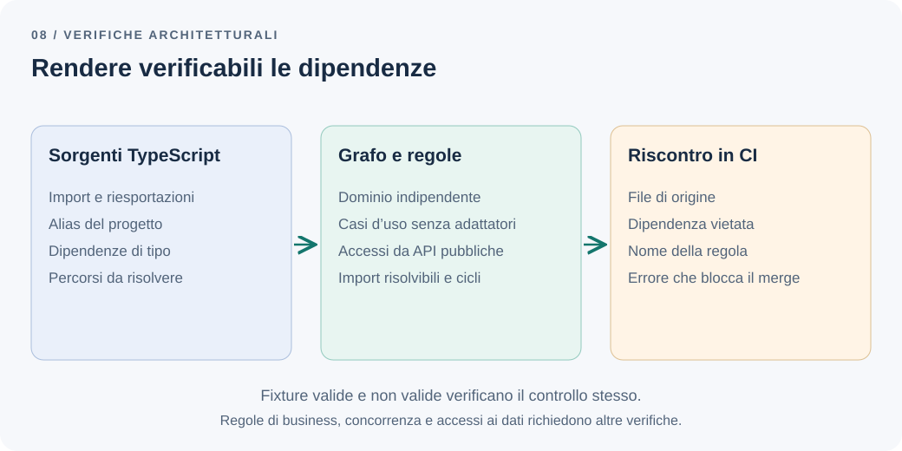

# Testare l'architettura, oltre alla logica di business

I test confermano che il quarto todo attivo viene rifiutato. Nel frattempo, per recuperare rapidamente un dato, qualcuno importa il repository di Account dentro Todo. Il comportamento rimane corretto e la CI passa, ma il confine concordato fra i moduli ha smesso di essere rispettato.

Un test del risultato non rileva necessariamente una dipendenza che renderà più costosa la prossima modifica.

**Come impediamo che i confini architetturali si erodano?**

## Il problema: le regole esistono soltanto nelle conversazioni

Abbiamo deciso che il [dominio non conosce NestJS](domain-http-error-mapping.md), che i casi d'uso non dipendono dai controller e che i contesti comunicano attraverso [superfici pubbliche](modular-monolith.md). Sono decisioni utili, ma una persona nuova nel team deve ricostruirle leggendo documenti, esempi e commenti nelle revisioni.

Sotto pressione, una dipendenza comoda sembra un'eccezione innocua. Dopo qualche mese altri file la copiano. La revisione architetturale diventa una discussione ripetitiva sugli stessi import, spesso quando il lavoro è già finito.

Automatizzare una parte di queste regole consente di ricevere un riscontro nel momento della modifica. Non dimostra che l'architettura sia buona: controlla che alcune decisioni esplicite continuino a valere.

## La soluzione più semplice: poche regole osservabili

Partirei dalle dipendenze che abbiamo già visto creare problemi, non da una matrice completa di tutti i file che possono comunicare.

| Regola | Modifica che vogliamo rendere sicura |
| --- | --- |
| Il dominio importa solo dal proprio dominio | Cambiare framework e persistenza senza riscrivere le regole |
| Application non importa presentation o infrastructure | Invocare i casi d'uso da ingressi diversi e sostituire gli adattatori |
| Gli altri contesti entrano solo da `public.ts` | Cambiare dettagli interni senza aggiornare tutti i chiamanti |
| Gli import devono essere risolvibili | Evitare che alias mal configurati nascondano dipendenze |

Nell'esempio adottiamo una politica volutamente restrittiva per il dominio, senza librerie esterne. Se una libreria pura diventasse utile, valuteremmo una deroga precisa. L'indipendenza non richiede per definizione di evitare ogni pacchetto.

Per pochi divieti può bastare ESLint, con la regola `no-restricted-imports` o un plugin come `eslint-plugin-boundaries`. Quando servono risoluzione degli alias e analisi del grafo, uno strumento dedicato come dependency-cruiser evita di costruire un parser artigianale. Chi preferisce scrivere le regole come test nel proprio runner può guardare librerie in stile ArchUnit, come `archunit` o `tsarch`; qui non le confronto. Una ricerca testuale resta utile per esplorare, ma può ignorare riesportazioni, percorsi equivalenti e import multilinea.

## Un esempio: controllare le dipendenze risolte

Assumiamo questa struttura nel progetto applicativo:

```text
src/
├── account/
│   ├── public.ts
│   ├── domain/
│   ├── application/
│   └── infrastructure/
├── todo/
│   ├── public.ts
│   ├── domain/
│   ├── application/
│   ├── infrastructure/
│   └── presentation/
└── bootstrap.ts
```

Possiamo descrivere le dipendenze vietate con dependency-cruiser. Il [riferimento delle regole](https://github.com/sverweij/dependency-cruiser/blob/main/doc/rules-reference.md) documenta `from`, `to`, `pathNot` e i gruppi come `$1`, che permettono di confrontare il modulo di origine con quello di destinazione.

```js
// .dependency-cruiser.cjs — nella radice del progetto applicativo
module.exports = {
  forbidden: [
    {
      name: "domain-only-own-domain",
      severity: "error",
      from: { path: "^src/([^/]+)/domain/" },
      to: { pathNot: "^src/$1/domain/" },
    },
    {
      name: "application-no-adapters",
      severity: "error",
      from: { path: "^src/[^/]+/application/" },
      to: { path: "^src/[^/]+/(presentation|infrastructure)/" },
    },
    {
      name: "contexts-through-public-api",
      severity: "error",
      from: { path: "^src/(account|todo)/" },
      to: {
        path: "^src/(account|todo)/",
        pathNot: "^src/$1/|^src/(account|todo)/public\\.ts$",
      },
    },
    {
      name: "no-unresolved-imports",
      severity: "error",
      from: { path: "^src/" },
      to: { couldNotResolve: true },
    },
    {
      name: "no-circular-imports",
      severity: "error",
      from: { path: "^src/" },
      to: { circular: true },
    },
  ],
  options: {
    doNotFollow: { path: "node_modules" },
    tsConfig: { fileName: "tsconfig.json" },
    tsPreCompilationDeps: true,
  },
};
```

È un esempio da adattare, non una configurazione installata in questo repository di articoli; l'ho eseguito con dependency-cruiser 18.4.0 e TypeScript 6.0.3 sulle fixture descritte più avanti. Nel progetto applicativo vanno installati dependency-cruiser e TypeScript come dipendenze di sviluppo, fissandone le versioni nel lockfile e controllando che TypeScript rientri nell'intervallo supportato dallo strumento. Uno script npm può eseguire:

```sh
depcruise --config .dependency-cruiser.cjs --output-type err src
```

L'opzione `tsConfig` deve puntare alla configurazione che definisce gli alias effettivamente usati. `tsPreCompilationDeps` include le dipendenze TypeScript che non sopravvivono alla compilazione (senza l'opzione, la fixture con `import type` non veniva segnalata nella mia prova); `doNotFollow` evita di esplorare gli interni delle dipendenze installate senza nascondere gli import verso di esse. Questi comportamenti sono descritti nel [riferimento delle opzioni](https://github.com/sverweij/dependency-cruiser/blob/main/doc/options-reference.md).

La regola sui contesti copre qui soltanto Account e Todo: quando aggiungiamo Report dobbiamo estenderla. Il bootstrap è esterno ai contesti perché compone le implementazioni. Non deve diventare una directory in cui spostare logica per eludere i controlli.

La regola sul dominio è restrittiva per costruzione: segnala anche i moduli integrati di Node, come `node:crypto`, e un file `*.spec.ts` dentro `domain/` che importa il framework di test. Nella prova sono stati segnalati entrambi. Se i test stanno accanto al codice, li escludiamo con `pathNot: "\\.spec\\.ts$"` nella parte `from` della regola, invece di aprire il dominio a tutte le librerie.



*Figura 1 — Un errore utile indica la dipendenza da rimuovere e la decisione che protegge.*

## Verificare anche il controllo

Un comando verde può significare che non ci sono violazioni oppure che non è stato analizzato il codice giusto. Prepariamo piccole fixture che usino gli stessi alias e le stesse estensioni del progetto:

| Import nella fixture | Risultato atteso | Regole che segnalano |
| --- | --- | --- |
| `todo/application` → `todo/domain` | Consentito | nessuna |
| `todo/infrastructure` → `account/public.ts` | Consentito | nessuna |
| `todo/domain` → `@nestjs/common` | Errore | `domain-only-own-domain` |
| `todo/application` → `todo/presentation` | Errore | `application-no-adapters` |
| `todo/application` → `account/infrastructure` | Errore | `application-no-adapters` e `contexts-through-public-api` |
| Lo stesso accesso privato attraverso un alias o `import type` | Errore | `contexts-through-public-api` |

Eseguiamo lo strumento su ogni fixture e controlliamo sia l'esito sia il nome della regola. Una fixture che fallisce perché manca una dipendenza non dimostra che il confine venga rilevato correttamente. Almeno un caso deve essere valido, altrimenti un controllo che rifiuta tutto sembrerebbe funzionare.

Un test può automatizzare la tabella. L'esempio usa l'API di dependency-cruiser e la sintassi comune a Jest e Vitest, con i globali attivi; le fixture stanno in `architecture/fixtures/`, ciascuna con il proprio `tsconfig.json`:

```ts
// architecture/boundaries.test.ts
import path from "node:path";
import { cruise, type ICruiseResult } from "dependency-cruiser";
import extractDepcruiseOptions from "dependency-cruiser/config-utl/extract-depcruise-options";
import extractTSConfig from "dependency-cruiser/config-utl/extract-ts-config";

const configFile = path.resolve(__dirname, "../.dependency-cruiser.cjs");

async function check(fixture: string) {
  const dir = path.resolve(__dirname, "fixtures", fixture);
  const tsConfigFile = path.join(dir, "tsconfig.json");
  const options = await extractDepcruiseOptions(configFile);
  const { output } = await cruise(
    ["src"],
    { ...options, baseDir: dir, tsConfig: { fileName: tsConfigFile } },
    {},
    { tsConfig: extractTSConfig(tsConfigFile) },
  );
  const { summary } = output as ICruiseResult;
  return {
    cruised: summary.totalCruised,
    rules: summary.violations.map((v) => v.rule.name).sort(),
  };
}

const cases: Array<[string, string[]]> = [
  ["01-ok-application-to-domain", []],
  ["02-ok-infrastructure-to-account-public", []],
  ["03-bad-domain-to-nestjs", ["domain-only-own-domain"]],
  ["04-bad-application-to-presentation", ["application-no-adapters"]],
  ["05-bad-application-to-account-infrastructure", ["application-no-adapters", "contexts-through-public-api"]],
  ["06a-bad-private-access-via-alias", ["contexts-through-public-api"]],
  ["06b-bad-private-access-via-import-type", ["contexts-through-public-api"]],
];

describe("regole architetturali", () => {
  it.each(cases)("%s", async (fixture, expected) => {
    const { cruised, rules } = await check(fixture);
    expect(cruised).toBeGreaterThan(0); // altrimenti il controllo non ha analizzato nulla
    expect(rules).toEqual([...expected].sort());
  });
});
```

`baseDir` e il percorso assoluto di `tsconfig.json` evitano di cambiare la directory corrente, operazione che i worker thread non consentono. La quinta fixture attiva due regole insieme e il test le aspetta entrambe, così una violazione in più o in meno viene notata.

La riga con `cruised` è la guardia contro un controllo che non ha analizzato nulla, e non è un caso teorico. Nella mia prova dependency-cruiser 18.4.0 dichiarava di supportare TypeScript `>=2.0.0 <7.0.0`: con TypeScript 7.0.2 installato ha stampato «0 modules, 0 dependencies cruised» e ha terminato con codice 0, anche sulle fixture con import vietati. Un avviso segnalava l'assenza di un compilatore compatibile, ma una CI che guarda soltanto il codice di uscita sarebbe rimasta verde. Con TypeScript 6.0.3 le stesse fixture producevano le violazioni attese.

Nel codice reale, una prova semplice consiste nell'introdurre temporaneamente un import vietato, osservare il fallimento e rimuoverlo. Ripeterei questa verifica quando cambia il resolver, il bundler o la struttura delle directory.

## Cosa il grafo non sa dire

Un `public.ts` può riesportare un repository interno. Gli altri moduli passano dal percorso consentito ma ricevono comunque dettagli privati. Il controllo degli archi diretti non valuta la qualità di quel contratto: servono revisione degli export o regole dedicate alle dichiarazioni pubbliche. Anche una dipendenza da `common/` può reintrodurre accoppiamento nascosto.

Gli import costruiti dinamicamente non sono sempre determinabili staticamente. Query SQL, permessi del database e chiamate HTTP verso altri servizi possono attraversare un confine senza produrre un import vietato. Per questi casi servono verifiche di integrazione e regole operative, come discusso nel [capitolo sui bounded context](bounded-contexts.md).

Infine, un grafo aciclico non garantisce il limite dei tre todo attivi. Quel comportamento richiede test della regola e prove concorrenti sul database. Il controllo architetturale risponde a una domanda diversa e si aggiunge agli altri test.

## Introdurre le regole in un progetto esistente

Se il progetto contiene molte violazioni, rendere subito bloccante ogni regola può fermare il lavoro senza migliorare il modello. Possiamo censire le dipendenze esistenti e vietarne di nuove, assegnando a ogni eccezione un responsabile e una condizione di rimozione.

Un'esclusione generica dell'intera directory `legacy/` tende però a diventare un rifugio permanente. Preferirei eccezioni circoscritte a dipendenze note e una riduzione progressiva. Una regola che tutti disabilitano segnala anche un possibile errore nella decisione architetturale: va discussa, non soltanto resa più severa.

## I compromessi e la decisione

Questi controlli riducono revisioni ripetitive e rendono osservabili le regressioni strutturali. Costano configurazione, tempo di CI e manutenzione quando cambia il progetto. Diventano rumore se impongono un'organizzazione senza una ragione concreta o se accumulano eccezioni incomprensibili.

Per Todo rendiamo bloccanti poche regole: indipendenza del dominio, casi d'uso senza adattatori, accessi pubblici tra contesti e import risolvibili. Controlliamo anche i cicli, verificando che i file pubblici non ne creino artificialmente. Manteniamo fixture e un test che dimostrino il funzionamento del controllo, con una guardia contro l'analisi vuota.

La misura del successo è pratica: una scorciatoia che viola una decisione viene segnalata durante la modifica, con una spiegazione comprensibile. Il team può così correggerla oppure rivedere consapevolmente la decisione.

---

[Capitolo precedente: Il dominio non dovrebbe conoscere HTTP](domain-http-error-mapping.md)

[Capitolo successivo: Dove dovrebbe finire una transazione?](transactions-eventual-consistency.md)

[Torna all'indice dei capitoli](../README.md#capitoli)
