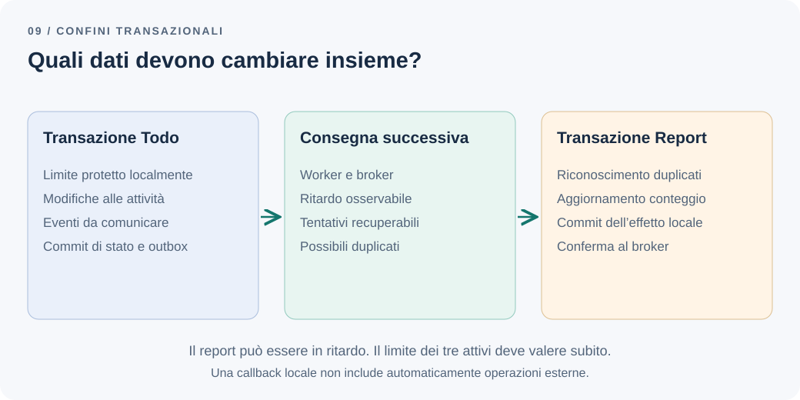

# Dove dovrebbe finire una transazione?

Un utente ha due todo attivi. Due richieste ne creano uno ciascuna: entrambe leggono due, entrambe passano il controllo, entrambe salvano. Abbiamo eseguito due transazioni valide dal punto di vista del database e violato una regola di business.

Nello stesso sistema, pretendere che il report venga aggiornato prima di confermare ogni completamento renderebbe invece una funzionalità secondaria parte del percorso critico. Servono decisioni diverse per vincoli diversi.

**Quali operazioni richiedono consistenza immediata?**

## Il problema: «tutto insieme» non definisce un confine

Una transazione locale rende atomiche le modifiche che vi partecipano. La correttezza in presenza di concorrenza dipende anche dall'isolamento e dal protocollo usato per leggere e modificare i dati. Scrivere `BEGIN` non trasforma qualsiasi sequenza di query in una regola corretta.

Allo stesso modo, una callback `transaction` non comprende automaticamente una chiamata HTTP, un'email o un'operazione eseguita da un repository su un'altra connessione. Il confine reale è dato dalle risorse coinvolte e dalle garanzie effettive.

Prima di scegliere dove collocarlo, rendiamo esplicito ciò che il prodotto promette:

| Operazione | Garanzia richiesta nell'esempio |
| --- | --- |
| Creare o riaprire un todo | Non superare mai tre attività attive per utente |
| Completare un todo | Confermare lo stato salvato e conservare il fatto da comunicare |
| Aggiornare Report | Recuperare i completamenti anche dopo guasti, accettando un ritardo |
| Inviare una notifica | Seguire una politica di consegna distinta dal salvataggio |

Il limite non tollera un quarto todo «per qualche secondo». Il report può invece essere temporaneamente indietro, purché il ritardo sia visibile e recuperabile.

## La soluzione più semplice: una transazione locale breve

Manteniamo nel modulo Todo le operazioni che proteggono il limite. Con PostgreSQL e isolamento `READ COMMITTED`, il protocollo già introdotto nel [monolite modulare](modular-monolith.md) blocca una riga stabile per utente, poi conta gli attivi con un comando successivo e decide se modificarli.

```ts
// Pseudocodice: tutti i repository usano la stessa transazione.
await db.transaction(async (tx) => {
  await tx.userState.ensureExists(ownerId); // INSERT … ON CONFLICT DO NOTHING
  await tx.userState.lockForUpdate(ownerId);
  const todo = await tx.todos.getForUpdate(todoId);
  assertOwnedBy(todo, ownerId);
  if (todo.isActive()) return;

  const activeCount = await tx.todos.countActive(ownerId);
  assertCanActivate(activeCount);
  todo.reopen();
  await tx.todos.save(todo);
});
```

La riga di coordinamento è univoca e viene creata, se manca, con `INSERT … ON CONFLICT DO NOTHING` prima di acquisire il lock. Le operazioni che acquisiscono più lock seguono un ordine coerente; creazione, riapertura e importazioni rispettano lo stesso protocollo. `ownerId` proviene da un contesto autorizzato, non da un parametro considerato affidabile senza controlli.

Il conteggio viene eseguito dopo aver acquisito il lock: a questo isolamento il nuovo comando vede le modifiche già confermate dalla precedente operazione. Un conteggio letto prima dell'attesa non offre la stessa garanzia.

Un'alternativa è `SERIALIZABLE`, gestendo i fallimenti di serializzazione con la ripetizione dell'intera transazione. PostgreSQL documenta questo requisito nel [capitolo sull'isolamento](https://www.postgresql.org/docs/18/transaction-iso.html#XACT-SERIALIZABLE). Cambiare livello non elimina il lavoro applicativo sui tentativi e sugli effetti esterni.

Ho provato queste varianti su PostgreSQL 18.0, con due sessioni concorrenti che partono da due todo attivi e tentano una creazione ciascuna:

| Variante | Todo attivi finali |
| --- | --- |
| Conteggio seguito da inserimento, senza coordinamento | 4 |
| Conteggio letto prima di attendere il lock | 4 |
| Lock sulla riga per utente, poi conteggio | 3 |
| `SERIALIZABLE`, senza lock | 3, con una transazione respinta dall'errore `40001` |

Le sessioni si sovrappongono perché una pausa di un secondo separa conteggio e inserimento: la prova rende deterministica una corsa che in produzione è rara e per questo pericolosa.

## Aggregati e transazioni non coincidono per definizione

Un aggregato delimita oggetti e regole che il modello protegge attraverso una radice. Non è automaticamente una tabella, un modulo o una transazione del database.

Se ogni `Todo` viene modellato come aggregato distinto, il limite dei tre riguarda più aggregati. Possiamo rivedere il modello introducendo un insieme delle attività attive per proprietario oppure coordinare la regola localmente con un servizio applicativo e un protocollo di persistenza esplicito. Non serve chiamare la riga di lock «aggregato» per giustificarla.

Caricare tutta la storia delle attività in un unico grande oggetto sarebbe invece costoso e non necessario per il limite. Il confine va valutato in base alle invarianti, alle dimensioni e alla contesa: utenti diversi devono poter lavorare indipendentemente, mentre operazioni dello stesso utente possono dover attendere.

Una transazione su più aggregati nello stesso database è tecnicamente possibile. Se capita spesso per le stesse regole, rivedrei i confini del modello; non introdurrei automaticamente comunicazione asincrona per rispettare uno slogan. Vaughn Vernon, in [Effective Aggregate Design](https://www.dddcommunity.org/library/vernon_2011/), propone regole pratiche per disegnare gli aggregati attorno ai vincoli di consistenza reali del dominio e non alla navigazione tra oggetti; la seconda parte tratta il rapporto tra aggregati diversi.

## Dopo il commit: una promessa diversa

Quando completiamo un todo, salviamo stato e messaggio nell'[outbox](outbox-pattern.md). Il commit conclude la transazione di Todo. Report aggiorna successivamente il proprio database in un'altra transazione.



*Figura 1 — La consistenza immediata protegge il comando; l'aggiornamento del report ha tempi e recupero propri.*

Questa consistenza eventuale richiede un percorso concreto verso l'allineamento: consegna recuperabile, effetti idempotenti, rilevazione dei messaggi bloccati e una fonte sufficiente per riconciliare i dati. Non significa che basti aspettare perché ogni problema si risolva.

L'interfaccia può confermare il completamento e indicare che il riepilogo si sta aggiornando, come discusso in [Quando una proiezione asincrona cambia il prodotto](cqrs-overkill.md#quando-una-proiezione-asincrona-cambia-il-prodotto). Se il report supera il ritardo concordato, il sistema deve renderlo osservabile. Una lettura vecchia non può autorizzare una nuova attività: il comando controlla sempre il limite sui dati autorevoli.

## Quando il processo attraversa più contesti

Per vedere il problema di una vera compensazione, usiamo un ordine con pagamento e disponibilità di magazzino. Forzare tutto nel piccolo esempio Todo nasconderebbe le differenze.

Se le informazioni appartengono allo stesso modello e database, aggiornare ordine e disponibilità in una transazione locale può essere la soluzione più semplice. Un addebito presso un fornitore esterno, però, non partecipa al rollback soltanto perché abbiamo inserito una riga `payment`.

Quando i partecipanti sono indipendenti possiamo modellare un processo a passi. Una [saga](https://microservices.io/patterns/data/saga.html) coordina transazioni locali e, in caso di fallimento, operazioni compensative. Non offre automaticamente rollback o isolamento equivalenti a una transazione ACID distribuita.

Un possibile processo applicativo è:

1. Ordini registra una richiesta in attesa.
2. Pagamenti richiede un'autorizzazione usando un identificativo stabile dell'operazione.
3. Magazzino tenta una prenotazione, proteggendo localmente la disponibilità.
4. Ordini conferma quando gli esiti richiesti sono acquisiti.

Se manca disponibilità, il processo chiede di annullare l'autorizzazione. Se il denaro fosse già stato incassato, servirebbe un rimborso, con tempi e condizioni diversi. Una compensazione è una nuova operazione di business: può fallire e non cancella ciò che altri hanno già osservato.

## Timeout, tentativi e stati intermedi

Un timeout su Pagamenti significa che non conosciamo l'esito. L'autorizzazione potrebbe essere riuscita. Prima di ripetere o compensare, il processo deve recuperare l'esito attraverso un riferimento stabile o usare un contratto idempotente del fornitore.

Conserviamo quindi lo stato del processo, i passi completati e le operazioni pendenti. Distinguiamo un rifiuto definitivo da un errore temporaneo e da un esito ancora sconosciuto. Mettiamo limiti ai tentativi e prevediamo riconciliazione o intervento operativo per i casi che non avanzano.

Nel frattempo l'ordine può essere visibile come «in attesa». Una prenotazione può avere una scadenza; il processo deve gestire anche l'arrivo tardivo di una risposta dopo la scadenza o dopo una richiesta di annullamento. L'assenza di isolamento globale rende questi stati parte del modello, non dettagli tecnici eliminabili dal diagramma.

Un orchestratore, cioè un *process manager* che conserva lo stato del processo, può rendere espliciti passi e recupero. Con pochi partecipanti, una coreografia di eventi e reazioni locali può bastare, ma la sequenza complessiva deve restare comprensibile. Una saga generica non è necessaria per consegnare un singolo evento a Report.

## I compromessi e la decisione

Una transazione locale offre un esito atomico e un recupero semplice tramite rollback, ma lock lunghi aumentano contesa e consumo di connessioni. Un processo distribuito permette autonomia dei partecipanti, ma introduce stati intermedi, messaggi duplicati, compensazioni e diagnosi più difficili. Il [capitolo successivo](distributed-systems-cost.md) ne elenca i costi operativi.

Le transazioni distribuite con *two-phase commit* possono essere valutate quando tutte le risorse supportano il protocollo e il costo di coordinamento è accettabile. PostgreSQL offre [`PREPARE TRANSACTION`](https://www.postgresql.org/docs/18/sql-prepare-transaction.html), ma la sua documentazione la destina a un gestore di transazioni esterno, non al codice applicativo. Non le assumiamo disponibili per broker e fornitori esterni, né trasformiamo una transazione locale utile in una saga senza un'esigenza concreta.

Per Todo manteniamo locale la garanzia dei tre attivi e registriamo i messaggi nella stessa transazione delle modifiche. Report si aggiorna dopo il commit. Verifichiamo la concorrenza sul limite e la ripresa delle consegne dopo un guasto.

Allargheremo o separeremo il confine solo dopo aver concordato cosa può essere temporaneamente incompleto, chi lo vedrà e come il processo tornerà in uno stato valido. È quella promessa a determinare dove deve finire la transazione.

---

[Capitolo precedente: Testare l'architettura, oltre alla logica di business](architecture-boundary-tests.md)

[Capitolo successivo: I microservizi sono anche una decisione operativa](distributed-systems-cost.md)

[Torna all'indice dei capitoli](../README.md#capitoli)
