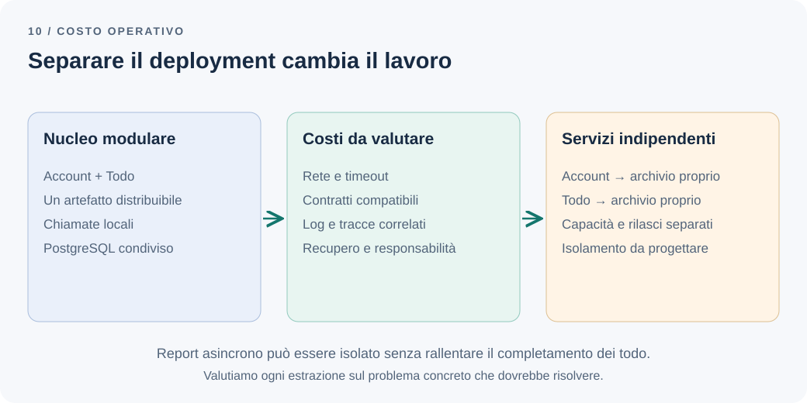

# I microservizi sono anche una decisione operativa

Il diagramma propone tre servizi: Account, Todo e Report. Ogni riquadro ha un database e un team potrebbe rilasciarlo separatamente. Nella discussione compaiono autonomia e scalabilità; rimane meno chiaro chi risponderà quando una richiesta attraverserà due servizi e terminerà con un timeout.

Separare il deployment cambia il modo in cui il sistema viene sviluppato, rilasciato e recuperato dopo un guasto. Il costo continua anche quando nessuno sta aggiungendo funzionalità.

**Quali benefici giustificano il costo operativo di un sistema distribuito?**

## Il problema: autonomia promessa, dipendenze reali

Torniamo all'applicazione Todo: un team, PostgreSQL, carico contenuto e nessuna attesa significativa per un rilascio comune. Account e Todo hanno confini espliciti. Il report storico riceve completamenti attraverso un contratto e può aggiornarsi in ritardo.

Estrarre Account aggiungerebbe una dipendenza di rete alla verifica del proprietario. Se ogni creazione richiedesse quella chiamata, un'indisponibilità di Account impedirebbe anche nuove attività. Il processo sarebbe separato, ma la disponibilità del caso d'uso rimarrebbe collegata a entrambi. In cifre: con due servizi sincroni al 99,9% ciascuno, assumendo guasti indipendenti, il percorso che li usa entrambi non supera circa il 99,8%, cioè da circa 8,8 a circa 17,5 ore di indisponibilità l'anno.

Estrarre Report potrebbe invece isolare calcoli pesanti senza aggiungere una chiamata sincrona al completamento. Le due estrazioni non hanno lo stesso valore, anche se sul diagramma producono riquadri simili.

Il punto di partenza è identificare un limite osservato: rilasci che si bloccano fra team, risorse consumate da una capacità specifica o requisiti di isolamento che un unico processo non soddisfa. Sono i segnali elencati nel capitolo sul [monolite modulare](modular-monolith.md#la-decisione-e-i-segnali-per-rivederla).

## La soluzione più semplice: migliorare ciò che esiste

Se il problema è l'accoppiamento del codice, partirei dal [monolite modulare](modular-monolith.md) e dai [controlli sulle dipendenze](architecture-boundary-tests.md). Se una query lenta rallenta l'applicazione, misurerei il piano di esecuzione, gli indici e i limiti di concorrenza prima di separare servizi.

Se il lavoro pesante è un'elaborazione in background, un worker separato può già offrire risorse e riavvii indipendenti, pur mantenendo repository e rilascio coordinati. In NestJS può essere un'[applicazione standalone](https://docs.nestjs.com/standalone-applications), creata con `NestFactory.createApplicationContext`, che riusa gli stessi moduli con un altro punto d'ingresso; senza listener di rete, middleware, interceptor, pipe e guard non sono disponibili. Non occorre dichiarare subito un nuovo microservizio con una piattaforma dedicata.

Anche il monolite richiede deployment ripetibili, monitoraggio e ripristino del database. I [prerequisiti dei microservizi descritti da Martin Fowler](https://martinfowler.com/bliki/MicroservicePrerequisites.html) evidenziano come automazione, osservabilità e collaborazione operativa diventino ancora più importanti quando aumentano le unità da gestire.

## Un esempio: quanto cambia il lavoro quotidiano

Confrontiamo due opzioni per il nucleo dell'applicazione. Nell'opzione distribuita consideriamo anche l'estrazione di Account: è una possibilità da valutare, non il risultato già deciso.

*Figura 1 — I confini del modello possono rimanere simili; cambiano comunicazione e responsabilità operative.*

| Aspetto | Account e Todo nello stesso deployment | Account e Todo separati |
| --- | --- | --- |
| Comunicazione | Chiamata locale attraverso un contratto | Rete, timeout e possibile esito sconosciuto |
| Rilascio | Un artefatto con versioni coordinate | Versioni diverse convivono durante aggiornamenti e rollback |
| Risorse | Si replica il nucleo insieme | Ogni servizio può avere capacità propria |
| Dati | Proprietà distinta nello stesso PostgreSQL | Archivi posseduti separatamente e coordinamento esplicito |
| Diagnosi | Un processo da seguire per il caso d'uso | Log e tracce da correlare tra processi |
| Guasti | Risorse e processo condivisi | Isolamento possibile, dipendente dalle chiamate e dalle risorse comuni |

Non sono vantaggi automatici. Due servizi sullo stesso nodo, con lo stesso database saturo, condividono ancora importanti cause di guasto. Due pipeline che richiedono sempre un rilascio simultaneo offrono poca autonomia effettiva: è un *monolite distribuito*, con i costi della rete e senza il beneficio dell'indipendenza.

Con archivi separati sparisce anche un'opzione del capitolo sul monolite modulare: la [vista condivisa](modular-monolith.md#e-le-letture-che-attraversano-i-moduli). Una schermata che combina dati di Account e Todo deve chiamare l'altro servizio o tenerne una copia che può restare indietro, e le operazioni che toccano entrambi gli archivi seguono le regole di [Dove dovrebbe finire una transazione?](transactions-eventual-consistency.md).

## Una chiamata di rete richiede una politica

La creazione di un todo chiama Account, poi scade il tempo disponibile. Il chiamante deve sapere se interrompere, usare un dato locale o rinviare l'operazione. Una cache può ridurre la dipendenza, ma introduce il problema della freschezza: un account appena disabilitato potrebbe risultare ancora abilitato.

Definiamo quindi timeout compatibili con il tempo totale del caso d'uso e tentativi limitati. Riprovare una lettura può essere accettabile; riprovare una creazione senza identificativo idempotente può duplicare effetti. Un timeout non dimostra che il destinatario non abbia eseguito il comando.

Distribuiamo inoltre la responsabilità dei retry con attenzione. Se gateway, servizio e client riprovano ciascuno, il carico cresce proprio durante un guasto. Limiti di concorrenza, attesa crescente e interruzione temporanea delle chiamate a una dipendenza in difficoltà devono seguire un comportamento concordato con il prodotto.

Il service discovery stabilisce dove raggiungere un servizio; autenticazione e autorizzazione stabiliscono chi può invocarlo e con quali permessi. Certificati, credenziali e segreti hanno proprietari, scadenze e procedure di rotazione. Un API gateway può centralizzare alcune funzioni, ma aggiunge a sua volta configurazione e una dipendenza operativa.

## I rilasci indipendenti richiedono compatibilità

Supponiamo che Account cambi il formato della risposta mentre alcune repliche di Todo usano ancora la versione precedente. Un rilascio progressivo crea questa convivenza anche quando le pipeline partono a pochi minuti di distanza.

I contratti devono quindi evolvere mantenendo compatibilità per una finestra concordata. Possiamo aggiungere un campo, aggiornare i consumatori e rimuovere quello precedente quando non serve più. I test del contratto aiutano a verificare il formato; la semantica richiede esempi condivisi, come nel [capitolo sugli eventi di integrazione](domain-vs-integration-events.md).

Anche le migrazioni devono permettere a vecchio e nuovo codice di convivere. Tornare al binario precedente non ripristina automaticamente dati cancellati o trasformati. Ogni servizio possiede migrazioni, backup e procedura di ripristino del proprio archivio.

Container e orchestrazione possono automatizzare riavvii, posizionamento e rollout. Richiedono però immagini aggiornate, limiti di risorse, controlli di salute e una piattaforma mantenuta. Kubernetes non è un requisito dei microservizi: scegliamo strumenti proporzionati al numero di servizi e alle competenze disponibili.

## Quando il guasto attraversa una coda

Report si ferma per un'ora. Todo può continuare a salvare attività e messaggi nell'[outbox](outbox-pattern.md), se resta capacità sufficiente. La separazione protegge il percorso dell'utente, ma il lavoro in attesa cresce e dovrà essere recuperato.

Osserviamo quindi ritardo del report, età del messaggio più vecchio, tasso di errori e capacità di smaltimento. Un allarme sulla sola CPU potrebbe non rilevare un consumer vivo che rifiuta tutti i messaggi.

Messaggi non elaborabili possono finire in una coda dedicata, spesso chiamata *dead-letter queue*. Qualcuno deve ispezionarli, correggere la causa e decidere il reinvio senza duplicare i conteggi. Retention, spazio disco e velocità di recupero sono parte del requisito di affidabilità. Il broker stesso è un componente con stato: aggiornamenti, alta disponibilità, retention e capacità richiedono un responsabile, come un database.

Per la diagnosi colleghiamo log e tracce attraverso identificativi di richiesta, processo ed evento, rispettando i confini dei dati sensibili. Una dashboard deve aiutare a rispondere a una domanda concreta: il completamento è stato salvato, pubblicato, ricevuto e applicato? Ogni passaggio ha un responsabile e una procedura di recupero.

## Quando il beneficio giustifica questi costi

Immaginiamo ora che Report venga gestito da un secondo team, con rilasci frequenti e calcoli che saturano risorse dedicate. Il cliente accetta un ritardo misurabile nei riepiloghi. Un servizio Report autonomo può offrire un beneficio concreto: capacità e rilasci indipendenti senza coinvolgere la transazione dei todo.

Prima dell'estrazione confronterei un worker separato con un servizio completo. Stimerei costo della piattaforma, tempo di manutenzione, turni di assistenza e impatto degli incidenti, oltre alla spesa dei server. Il team deve poter diagnosticare e recuperare il servizio senza dipendere sempre da chi mantiene Todo.

Verificherei poi il beneficio con segnali osservabili: diminuzione delle attese per rilasciare, assenza di regressioni sulla latenza dei comandi, recupero del backlog entro l'obiettivo concordato. Non userei il numero dei servizi come misura di avanzamento architetturale.

## La decisione per questa applicazione

Manteniamo Account e Todo nel monolite modulare. Non abbiamo un problema di rilascio o capacità che giustifichi introdurre una chiamata di rete nel percorso di creazione.

Per Report preserviamo il contratto asincrono e la proprietà dei dati. Se carico e organizzazione richiedono autonomia, lo distribuiamo separatamente con deduplicazione, metriche sul ritardo e responsabilità di recupero definite. Proviamo un arresto e il successivo smaltimento dei messaggi prima di considerare conclusa l'estrazione.

I microservizi possono comprare autonomia di rilascio, capacità e isolamento. Il prezzo comprende il lavoro necessario a mantenere quelle proprietà durante guasti e cambiamenti. La decisione è sostenibile quando sappiamo indicare sia il beneficio atteso sia chi gestirà quel lavoro ogni giorno.

---

[Capitolo precedente: Dove dovrebbe finire una transazione?](transactions-eventual-consistency.md)

[Capitolo successivo: Dalla palla di fango ai confini espliciti](from-big-ball-of-mud.md)

[Torna all'indice dei capitoli](../README.md#capitoli)
