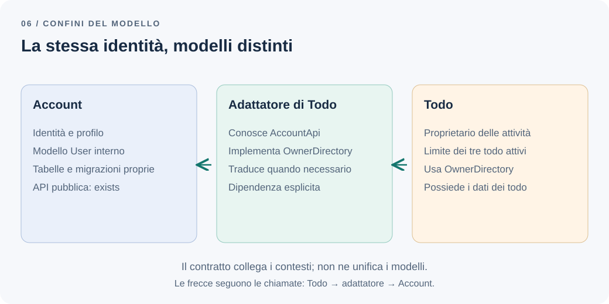

# I bounded context sono più di semplici cartelle

Account e Todo hanno directory separate, ma condividono una classe `User`. Account vi aggiunge lo stato di verifica dell'email; Todo vi inserisce il numero di attività attive. Ogni modifica obbliga entrambi i moduli a ricompilare, adattare test e discutere campi che interessano soltanto all'altro.

Il codice è ordinato per cartelle. Il modello continua ad avere responsabilità sovrapposte.

**Il confine del modello è visibile e verificabile nel codice?**

## Il problema: una parola, responsabilità diverse

Nell'applicazione Todo, Account gestisce identità e profilo. Todo governa attività e limite dei tre todo attivi. Per Account, un utente ha email, nome e cognome. Per Todo, il proprietario identifica chi può gestire le attività e a chi applicare il limite. Il secondo modello non ha necessariamente bisogno di tutti i dati del primo.

Condividere la stessa identità non impone di condividere lo stesso oggetto. Una classe `User` universale tende invece ad accumulare significati: account verificato, proprietario delle attività, destinatario dei report. Le condizioni di validità diventano difficili da esprimere senza coinvolgere funzionalità estranee.

Come descrive [Martin Fowler parlando di bounded context](https://martinfowler.com/bliki/BoundedContext.html), un modello rimane coerente entro un confine esplicito; concetti comuni possono avere rappresentazioni differenti in contesti diversi. Le relazioni fra quei contesti vanno progettate, non eliminate fingendo che il significato sia sempre identico.

## Dominio, sottodominio e confine del modello

Il **dominio** è l'ambito del problema che stiamo affrontando. Un **sottodominio** ne individua una parte, per esempio la gestione delle attività personali. Un **bounded context** delimita dove un certo modello e il relativo linguaggio sono validi. I primi descrivono il problema; il secondo è una scelta su come modellarlo nel software.

Non ricaviamo questi confini contando tabelle o servizi. Il modulo `notifications/` potrebbe essere soltanto un adattatore tecnico. Una dashboard potrebbe essere una query di Todo, senza un modello autonomo. Report diventa un contesto distinto nel nostro scenario quando possiede definizioni, regole di aggregazione e un'evoluzione propria, non semplicemente perché riceve messaggi.

Anche Account e Todo sono una proposta da verificare con il lavoro reale. Se ogni requisito impone di cambiarli insieme e non emergono significati differenti, separarli rigidamente può costare più di quanto aiuti.

## La soluzione più semplice: rendere esplicite le responsabilità

Partirei da una conversazione su tre domande: chi decide una regola, quali informazioni gli servono e chi può modificare quei dati. La struttura delle directory viene dopo.

| Contesto | Decisioni proprie | Informazioni ricevute |
| --- | --- | --- |
| Account | Gestione del profilo e ciclo di vita dell'account | Richieste dell'utente |
| Todo | Creazione, completamento, riapertura e limite degli attivi | Identificativo del proprietario e informazioni concordate da Account |
| Report | Conteggi e raggruppamenti temporali | Fatti di completamento pubblicati da Todo |

Nel [monolite modulare](modular-monolith.md), Account può esporre una piccola API chiamata nello stesso processo. Non serve una rete per far rispettare un confine. Todo conserva l'identificativo e possiede la propria riga di coordinamento per il limite: non modifica l'entità di Account per aggiungervi un contatore.

## Un esempio: dipendere da ciò che serve

Questa dipendenza attraversa il confine passando dai dettagli interni:

```ts
// todo/application/create-todo.ts
import { AccountRepository } from "../../account/internal/repository";
import type { User } from "../../account/domain/user";
```

Il repository espone modalità di accesso e il tipo `User` può trascinare il modello di Account nel caso d'uso. Un `import type` scompare a runtime, ma resta una dipendenza di sviluppo.

Possiamo invece definire ciò che Todo richiede e collegarlo alla superficie pubblica di Account:

```ts
// todo/application/owner-directory.ts
export interface OwnerDirectory {
  exists(ownerId: string): Promise<boolean>;
}

// todo/infrastructure/account-owner-directory.ts
import type { AccountApi } from "../../account/public";
import type { OwnerDirectory } from "../application/owner-directory";

export class AccountOwnerDirectory implements OwnerDirectory {
  constructor(private readonly accounts: AccountApi) {}

  exists(ownerId: string): Promise<boolean> {
    return this.accounts.exists(ownerId);
  }
}
```

Il contratto `AccountApi` è quello introdotto nel capitolo sul monolite. Il bootstrap collega le implementazioni. Il caso d'uso dipende da `OwnerDirectory`, mentre l'adattatore conosce la superficie pubblica esterna. Sono frammenti illustrativi: il controllo di esistenza non autentica l'utente e non autorizza l'accesso alle attività.

Per una semplice inoltrata, questo adattatore può essere superfluo: usare direttamente `AccountApi` nel livello applicativo è una scelta ragionevole se il team accetta quella dipendenza. Il passaggio diventa utile quando Todo deve proteggersi da un linguaggio esterno, da più fornitori o da un contratto instabile.

Se un sistema esterno restituisse `customerStatus: "ENABLED"`, Todo potrebbe tradurlo nel concetto locale concordato di proprietario abilitato. Questa protezione semantica è il motivo di una *anti-corruption layer*: evitare che il modello esterno detti quello interno. Rinominare campi senza una differenza di significato non giustifica automaticamente un nuovo livello.



*Figura 1 — La superficie pubblica rende esplicita la relazione. Il deployment può rimanere unico.*

## Il database può aggirare il confine

Bloccare gli import non basta se Todo esegue query arbitrarie su `account.users`. Una rinomina di colonna torna a propagarsi senza passare dal contratto.

Assegniamo quindi un proprietario a tabelle e migrazioni. Schemi distinti aiutano a riconoscerlo, ma la barriera effettiva dipende anche da query, repository e permessi. Nel monolite possiamo iniziare con regole e revisione del codice; per esigenze più forti valutiamo credenziali separate, considerando il costo di gestirle.

Una join trasversale per un report può essere un compromesso esplicito, per esempio su una vista pubblica mantenuta dal proprietario. Documentiamo quali cambiamenti richiedono coordinamento. Un accesso in sola lettura rimane una dipendenza dallo schema e può creare carico sul database altrui.

Lo stesso vale per una foreign key tra contesti. Offre integrità locale, ma lega migrazioni e ciclo di vita dei dati. Evitarla senza un'alternativa non rende automaticamente il sistema migliore: occorre decidere come gestire riferimenti non più validi.

## Comunicare significa anche concordare il tempo

`exists` risponde sullo stato osservato in quel momento. L'account può essere cancellato dopo il controllo. Se il prodotto richiede che nessun todo venga creato dopo l'avvio della cancellazione, serve un protocollo che renda effettivo quel vincolo; due cartelle e una chiamata non lo forniscono.

Per Report accettiamo invece aggiornamenti successivi. Il [contratto di integrazione](domain-vs-integration-events.md) stabilisce cosa significa un completamento, mentre l'[outbox](outbox-pattern.md) conserva i messaggi da consegnare. La relazione comprende formato, responsabilità, ritardo accettabile e recupero degli errori.

Un pacchetto condiviso può contenere questi contratti. Se comincia a esportare entità, repository e regole interne, ricrea un modello comune senza dichiararlo. Terrei piccola quella superficie e verificherei anche ciò che i suoi file riesportano.

## I compromessi e la decisione

Confini espliciti permettono a ogni modello di evolvere secondo le proprie esigenze. Introducono però mapping, contratti, talvolta dati duplicati e discussioni sulla consistenza. Un modello condiviso intenzionalmente può essere meno costoso quando significato e ciclo di modifica coincidono.

Per questa applicazione manteniamo Account e Todo nello stesso deployment, con responsabilità e dati distinti. Todo consulta l'API pubblica di Account; Report riceve fatti confermati. Non creiamo un contesto per ogni entità o una rete di adattatori per ogni chiamata.

La verifica concreta è una modifica: rinominare una colonna privata di Account non dovrebbe richiedere interventi in Todo, finché l'API conserva il significato concordato. Se invece cambia quel significato, il coordinamento è necessario e deve essere visibile. Nel [capitolo sui test architetturali](architecture-boundary-tests.md) renderemo automatici alcuni di questi controlli.

---

[Capitolo precedente: Perché salvare dati e pubblicare un evento è difficile](outbox-pattern.md)

[Capitolo successivo: Il dominio non dovrebbe conoscere HTTP](domain-http-error-mapping.md)

[Torna all'indice dei capitoli](../README.md#capitoli)
