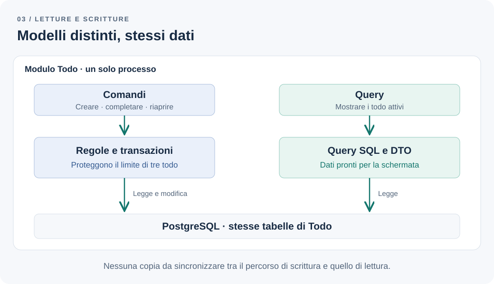

# Quando CQRS è eccessivo

La schermata dei todo deve mostrare titolo, stato e numero di attività ancora disponibili. Per costruirla, il codice carica gli stessi oggetti usati per creare e completare le attività, attraversa relazioni e aggiunge campi che servono soltanto alla presentazione. Ogni modifica alla schermata finisce per toccare il modello che protegge le regole di business.

Il team propone CQRS. Nella discussione compaiono subito due database, un broker e un processo che aggiorna le viste. Prima di scegliere questi componenti, serve capire quanto del problema richieda davvero una separazione infrastrutturale.

**Il modello di lettura e scrittura giustifica la complessità aggiuntiva?**

## Il problema: due esigenze nello stesso modello

Riprendiamo il [monolite modulare del capitolo precedente](modular-monolith.md): un solo team, un'applicazione e PostgreSQL. Il modulo Todo governa creazione, completamento e riapertura; ogni utente può avere al massimo tre todo attivi.

La scrittura deve decidere se un'operazione è consentita e proteggere il limite anche con richieste concorrenti. La lettura deve restituire pochi dati, ordinati e pronti per la schermata. Non serve ricostruire tutti gli oggetti coinvolti nelle modifiche per mostrare una lista.

Nello scenario iniziale il carico è contenuto. Non abbiamo misurato problemi di capacità del database. Il fastidio osservato è che il modello accumula responsabilità diverse: regole, persistenza e campi per la visualizzazione. È su questo costo che valutiamo la prima modifica.

## La soluzione più semplice: query dedicate

Un'applicazione CRUD può già avere casi d'uso espliciti, validazioni e transazioni. Non richiede di esporre aggiornamenti arbitrari alle tabelle. Possiamo mantenere `create`, `complete` e `reopen`, aggiungendo una query che selezioni soltanto i campi necessari alla schermata.

Separare funzioni che modificano lo stato da funzioni che lo leggono rende più chiaro il codice. Creare due cartelle o due handler, però, non dimostra che servano modelli distinti. Se entrambi continuano a usare la stessa rappresentazione per le stesse esigenze, il beneficio può limitarsi all'organizzazione.

Il passo verso CQRS consiste nel permettere a letture e scritture di usare modelli differenti: uno orientato alle operazioni e alle regole, l'altro alle informazioni richieste. Questa è la distinzione descritta da [Martin Fowler nell'articolo su CQRS](https://martinfowler.com/bliki/CQRS.html). La separazione può rimanere interna allo stesso modulo e usare le stesse tabelle.

## Quanto stiamo separando?

Le scelte seguenti comportano impegni diversi. Non sono tappe obbligatorie di una crescita architetturale.

| Scelta | Cosa cambia | Costo da giustificare |
| --- | --- | --- |
| CRUD con un modello condiviso | Letture e modifiche usano una rappresentazione comune | Il modello può accumulare esigenze incompatibili |
| Separazione logica tra comandi e query | Percorsi e responsabilità diventano espliciti | Più componenti, anche se il modello resta comune |
| CQRS sulle stesse tabelle | Modelli distinti per operazioni e letture | Mapping e dipendenze dallo schema da mantenere |
| CQRS con dati di lettura precalcolati | Una struttura persistente serve query specifiche | Dati duplicati e aggiornamenti da coordinare |
| CQRS con proiezioni asincrone | Le strutture di lettura si aggiornano dopo la scrittura | Ritardi, recupero degli errori e monitoraggio |

Un modello di lettura può essere un DTO costruito da una query, senza una copia persistente dei dati. Se introduciamo una tabella di riepilogo nello stesso database, possiamo invece aggiornarla nella transazione di scrittura: manteniamo l'atomicità, ma aggiungiamo lavoro a ogni modifica.

Asincronia e database separati sono ulteriori decisioni. Anche la [documentazione Microsoft su CQRS](https://learn.microsoft.com/en-us/azure/architecture/patterns/cqrs) distingue modelli sullo stesso database da modelli su archivi diversi. CQRS non richiede un broker né Event Sourcing, cioè la conservazione dello stato attraverso una sequenza di eventi.



*Figura 1 — Modelli distinti possono usare gli stessi dati, senza un processo di sincronizzazione.*

## Un esempio: riaprire un todo e mostrare la lista

Possiamo rendere visibili le due esigenze nei contratti TypeScript:

```ts
// Contratto del caso d'uso: esprime un'intenzione.
export interface TodoCommands {
  reopen(input: { ownerId: string; todoId: string }): Promise<void>;
}

// Modello di lettura: contiene i dati richiesti dalla schermata.
export type ActiveTodoList = {
  items: ReadonlyArray<{ id: string; title: string }>;
  activeCount: number;
};

export interface TodoQueries {
  listActive(ownerId: string): Promise<ActiveTodoList>;
}
```

Sono contratti illustrativi, non implementazioni complete. L'identità deve essere verificata e l'accesso autorizzato in entrambi i percorsi: un parametro `ownerId` non costituisce una protezione.

L'implementazione di `reopen` verifica che il todo appartenga all'utente e ne governa la transizione di stato. Per proteggere il limite conserva il protocollo transazionale descritto nel capitolo precedente: lock sulla riga di coordinamento dell'utente, verifica dello stato e conteggio, eventuale aggiornamento. Una chiamata a un command handler, da sola, non risolve la concorrenza.

`listActive` può eseguire una query sulle tabelle possedute da Todo e costruire il DTO senza caricare il modello di scrittura. In questo esempio la lista contiene tutti i todo attivi, al massimo tre: `activeCount` può essere derivato dalla lunghezza del risultato, evitando un secondo conteggio. Non estendiamo questo ragionamento a una lista paginata, dove lunghezza della pagina e totale sono diversi.

Le due interfacce possono essere chiamate direttamente dallo stesso controller. API applicative separate non implicano host o servizi HTTP separati; un command bus non è necessario per invocare il caso d'uso.

Il costo rimane concreto: una modifica allo schema può richiedere di aggiornare sia la persistenza di scrittura sia le query. Queste dipendenze restano interne a Todo, rispettando i confini stabiliti nel capitolo precedente.

## Quando una proiezione asincrona cambia il prodotto

Supponiamo ora di mantenere il conteggio in una proiezione aggiornata in background. Un utente ha tre todo attivi e ne completa uno. La scrittura riesce, ma la proiezione mostra ancora tre attività: l'interfaccia potrebbe continuare a disabilitare la creazione.

Accade anche il contrario. Dopo una creazione, un conteggio in ritardo può mostrare un posto disponibile quando il limite è già raggiunto. **Il comando deve verificare la regola sui dati autorevoli, all'interno della propria transazione.** Il conteggio visualizzato aiuta l'utente, ma non autorizza l'operazione.

Il ritardo richiede una scelta di prodotto: mostrare un aggiornamento in corso, usare il risultato del comando per aggiornare temporaneamente la schermata oppure attendere che la proiezione raggiunga una versione attesa. Occorre concordare quanto ritardo sia accettabile e cosa mostrare se l'aggiornamento si blocca.

Il team deve inoltre gestire consegne duplicate, ordinamento dove necessario, nuovi tentativi e recupero delle proiezioni. Se una vista va ricostruita, serve una fonte completa: lo stato corrente può bastare per la lista attiva, ma non per un report storico di tutte le riaperture. Pubblicare alcuni eventi non garantisce di aver conservato quella storia.

Sono nuove responsabilità operative e funzionali, difficili da giustificare per evitare una semplice query.

## Quando il beneficio diventa concreto

Nel nostro esempio manterrei query dirette finché le letture rimangono piccole e misurabilmente adeguate. Valuterei una separazione maggiore se una dashboard dovesse aggregare grandi volumi di attività, se le sue query degradassero le scritture o se le rappresentazioni richieste cambiassero molto più spesso delle regole.

Prima misurerei tempi di risposta, piani delle query e carico, valutando indici e query più mirate. Se il problema riguarda soltanto un report, una struttura dedicata a quel report può essere sufficiente; non serve trasformare ogni lettura dell'applicazione.

Una proiezione persistente può ridurre il lavoro necessario a servire la dashboard, ma sposta lavoro sugli aggiornamenti. Un archivio separato può offrire risorse dedicate, ma richiede sincronizzazione e gestione operativa. La scelta dipende dal beneficio misurato e dalla tolleranza al ritardo.

Quando invece le schermate riflettono quasi direttamente i dati salvati e le regole sono poche, duplicare modelli e introdurre handler che inoltrano soltanto chiamate aumenta il lavoro senza risolvere un problema osservato.

## La decisione per questa applicazione

Manteniamo un deployment e un database. Nel modulo Todo separiamo i casi d'uso di scrittura dalle query per la schermata, con DTO dedicati dove riducono l'accoppiamento. Il limite dei tre todo resta protetto dal percorso transazionale di scrittura.

Per verificare la scelta controlliamo due risultati: una modifica ai campi della lista non richiede di cambiare le regole di riapertura, e le operazioni concorrenti continuano a rispettare il limite. Misuriamo le letture prima di introdurre copie persistenti dei dati.

Rivedremo la decisione quando una lettura specifica richiederà una struttura dedicata o risorse indipendenti, concordando con il cliente la freschezza necessaria. La separazione utile oggi può fermarsi alle responsabilità nel codice: ogni ulteriore componente deve risolvere un problema che sappiamo descrivere.

---

[Capitolo precedente: Quando basta un monolite modulare](modular-monolith.md)

[Capitolo successivo: Gli eventi di dominio non sono eventi di integrazione](domain-vs-integration-events.md)

[Torna all'indice dei capitoli](../README.md#capitoli)
