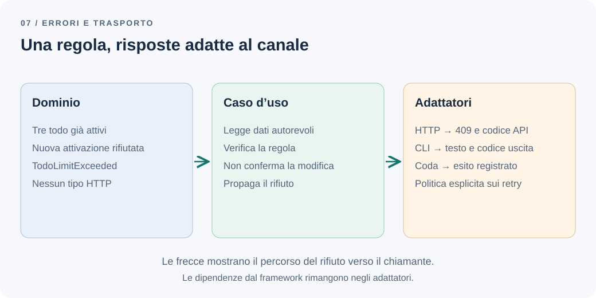

# Il dominio non dovrebbe conoscere HTTP

Un utente con tre todo attivi prova a crearne un quarto. Il codice rifiuta correttamente l'operazione, ma lo fa lanciando `ConflictException` da una classe di dominio. Quando aggiungiamo un'importazione da riga di comando, anche quella deve conoscere le eccezioni HTTP di NestJS per capire cosa sia successo.

La regola è riutilizzabile. La sua rappresentazione dell'errore la lega invece a un punto d'ingresso specifico.

**Il dominio avrebbe ancora senso senza HTTP?**

## Il problema: una decisione di business dentro un protocollo

Il limite dei tre todo attivi si applica alla creazione e alla riapertura, indipendentemente da chi invochi il caso d'uso. Un controller REST, un comando CLI e un consumer possono incontrare lo stesso rifiuto, ma devono comunicarlo in modi diversi.

Il controller restituisce uno status e un corpo JSON. La CLI stampa una spiegazione ed esce con un codice concordato. Il consumer decide se registrare un rifiuto, riprovare o richiedere un intervento. Nessuna di queste scelte modifica la regola.

Questo codice mescola le due responsabilità:

```ts
// todo/domain/active-todo-limit.ts
import { ConflictException } from "@nestjs/common";

export function assertCanActivate(activeCount: number): void {
  if (activeCount >= 3) {
    throw new ConflictException("Limite dei todo attivi raggiunto");
  }
}
```

La dipendenza non diventa innocua perché il test passa. Il modello ha bisogno di un framework di trasporto per esprimere una decisione propria.

## La soluzione più semplice: un errore significativo

Possiamo partire da una classe TypeScript, senza una gerarchia generale di errori:

```ts
// todo/domain/active-todo-limit.ts
export class TodoLimitExceeded extends Error {
  readonly limit = 3;

  constructor() {
    super("Active todo limit exceeded");
    this.name = "TodoLimitExceeded";
  }
}

export function assertCanActivate(activeCount: number): void {
  if (activeCount >= 3) throw new TodoLimitExceeded();
}
```

Il numero proviene da un conteggio autorevole, letto dal caso d'uso nella transazione che protegge la modifica. La funzione valuta la regola; non rende sicuro un conteggio obsoleto. Il protocollo di concorrenza rimane quello del [capitolo sul monolite modulare](modular-monolith.md).

Non esponiamo direttamente `error.message` al client. Il messaggio interno aiuta lo sviluppatore; il contratto pubblico richiede un codice stabile e un testo scelto per chi usa l'API. Una modifica alla formulazione interna non dovrebbe rompere il frontend.

## Un esempio: tradurre al confine HTTP

In NestJS possiamo usare un exception filter. La [documentazione ufficiale sui filtri](https://docs.nestjs.com/exception-filters) descrive come intercettare tipi specifici e costruire la risposta. Questo esempio usa l'adattatore Express:

```ts
// todo/presentation/http/todo-limit.filter.ts
import { Catch } from "@nestjs/common";
import type { ArgumentsHost, ExceptionFilter } from "@nestjs/common";
import type { Response } from "express";
import { TodoLimitExceeded } from "../../domain/active-todo-limit";

@Catch(TodoLimitExceeded)
export class TodoLimitFilter
  implements ExceptionFilter<TodoLimitExceeded> {
  catch(error: TodoLimitExceeded, host: ArgumentsHost): void {
    const response = host.switchToHttp().getResponse<Response>();
    response.status(409).json({
      code: "TODO_LIMIT_EXCEEDED",
      message: "Completa un'attività prima di attivarne un'altra.",
      limit: error.limit,
    });
  }
}
```

Il filtro va associato al controller Todo, per esempio con `@UseFilters(TodoLimitFilter)` importato da `@nestjs/common`. Non basta definirne la classe perché venga eseguito. Con Fastify cambiano tipo della risposta e metodo di invio; la classe di dominio rimane identica.

Il codice intercetta solo il rifiuto atteso. Gli altri errori continuano nel percorso generale di gestione: un database irraggiungibile non deve diventare un falso «limite raggiunto». Un gestore degli errori inattesi registra dettagli diagnostici internamente e restituisce una risposta generica, senza esporre query o stack trace.



*Figura 1 — Lo stesso significato può richiedere risposte diverse ai diversi punti d'ingresso.*

## Perché 409, e chi lo decide

Qui scegliamo `409 Conflict`: la richiesta di attivare un todo entra in conflitto con lo stato corrente delle attività dell'utente. Il client può risolverlo completandone una. Questo utilizzo è coerente con la [semantica di 409 definita da HTTP](https://www.rfc-editor.org/rfc/rfc9110.html#name-409-conflict).

Non è una proprietà intrinseca di `TodoLimitExceeded`. Un'altra API potrebbe adottare una convenzione documentata differente. La decisione appartiene al contratto HTTP e deve essere applicata coerentemente.

| Situazione | Responsabilità | Esempio di risposta HTTP |
| --- | --- | --- |
| JSON non leggibile | Parsing del trasporto | `400` |
| Credenziali assenti o non valide | Autenticazione | `401`, secondo il meccanismo adottato |
| Operazione non autorizzata | Politica di accesso | `403`, o `404` se il contratto nasconde l'esistenza |
| Limite dei todo raggiunto | Regola di business | `409` nella nostra API |
| Errore inatteso | Gestione tecnica | `500` generico |

Una risposta `400` a un payload malformato non richiede un errore di dominio. Viceversa, un titolo vuoto può violare anche una regola del modello: la validazione all'ingresso migliora il feedback, ma non deve lasciare gli altri ingressi liberi di aggirare il vincolo.

## CLI e code: tradurre significa decidere cosa fare

La CLI può intercettare `TodoLimitExceeded`, spiegare il rifiuto e usare un codice di uscita documentato. I suoi chiamanti non dovrebbero interpretare uno status HTTP incorporato nell'errore.

Un consumer richiede più attenzione. Se un comando di creazione trova tre todo attivi, ripeterlo subito cento volte non risolve il problema. Nel nostro scenario registriamo durevolmente l'esito di business e confermiamo la ricezione; sarà una nuova richiesta dell'utente a tentare ancora. Se il prodotto volesse invece accodare attività fino alla disponibilità di un posto, servirebbero un nuovo stato e una politica esplicita di attesa.

Un errore temporaneo di connessione può giustificare nuovi tentativi, mantenendo l'identificativo dell'operazione e gli opportuni limiti. Non basta distinguere classi di eccezioni: bisogna conoscere la semantica del comando e se ripeterlo possa duplicarne gli effetti. Il [capitolo sull'outbox](outbox-pattern.md) affronta il caso della consegna ripetuta di eventi.

L'errore TypeScript viaggia come oggetto soltanto dentro il processo. Su una rete o una coda si invia un contratto serializzato; `instanceof TodoLimitExceeded` non riconosce automaticamente un JSON ricevuto da un altro servizio.

## Quando usare un risultato esplicito

Se i rifiuti attesi sono numerosi, il caso d'uso può restituire un'unione discriminata:

```ts
type CreateTodoResult =
  | { ok: true; todoId: string }
  | { ok: false; reason: "limit-exceeded"; limit: number };
```

Il chiamante deve gestire l'esito e l'adattatore lo traduce. Gli errori inattesi restano sul percorso tecnico. Questo stile rende visibili i rifiuti nel tipo di ritorno, al prezzo di ramificazioni nei chiamanti.

Attenzione alla transazione: restituire `{ ok: false }` da una callback non implica un rollback. Una regola va verificata prima delle scritture oppure il coordinamento transazionale deve annullare esplicitamente le modifiche. Scegliere tra eccezioni e risultati non deve cambiare l'atomicità del caso d'uso.

## I compromessi e la decisione

Separare errore e trasporto aggiunge un mapping e verifiche specifiche per l'adattatore. In cambio possiamo cambiare framework, aggiungere una CLI e testare la regola senza avviare un server. Non serve un catalogo universale di errori per ottenere questo beneficio.

Per Todo scegliamo una piccola eccezione di dominio e un filtro HTTP mirato. Un test della regola controlla il rifiuto con tre attività; un test HTTP controlla `409` e `TODO_LIMIT_EXCEEDED`; una prova con un errore inatteso verifica che non venga trasformato nel rifiuto di business. La concorrenza si verifica separatamente sul database.

Manteniamo nel dominio il significato dell'errore e nei punti d'ingresso la risposta appropriata. Rivedremo lo stile di ritorno se il numero di esiti attesi renderà difficile capire il contratto dei casi d'uso.

---

[Capitolo precedente: I bounded context sono più di semplici cartelle](bounded-contexts.md)

[Capitolo successivo: Testare l'architettura, oltre alla logica di business](architecture-boundary-tests.md)

[Torna all'indice dei capitoli](../README.md#capitoli)
