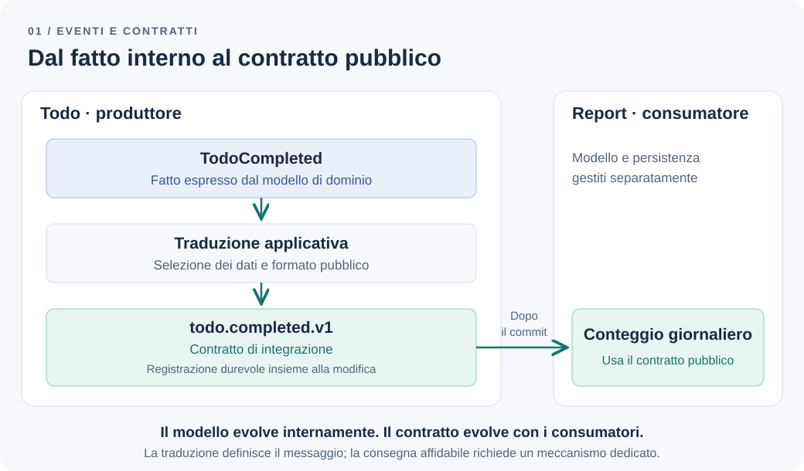

# Gli eventi di dominio non sono eventi di integrazione

Un utente completa un todo. Il modulo Todo aggiorna lo stato e produce `TodoCompleted`. In seguito, un sistema di report deve conoscere i completamenti: sembra naturale inviargli lo stesso oggetto.

Qualche settimana dopo cambiamo il modello interno. Un campo viene rinominato e il report smette di funzionare. Quello che consideravamo un dettaglio del dominio era diventato, senza una decisione esplicita, un contratto con un altro sistema.

**Un concetto interno al dominio dovrebbe diventare un contratto pubblico?**

## Il problema: destinatari con esigenze diverse

Nella nostra applicazione, Todo governa creazione, completamento e riapertura. Il limite resta di tre attività attive per utente. Completarne una libera un posto attraverso l'aggiornamento dello stato, nella transazione del modulo: questo comportamento non deve aspettare un consumatore di eventi.

Aggiungiamo un requisito: un sistema di report, mantenuto separatamente, deve contare i completamenti per utente e giorno. Il cliente accetta un aggiornamento ritardato, ma non la perdita definitiva dei completamenti.

Chiariamo anche cosa contare. Completare, riaprire e completare di nuovo la stessa attività produce due completamenti. Ripetere la richiesta su un todo già completato non ne produce un terzo. Il report misura queste transizioni, non il numero di attività attualmente completate.

Todo e Report hanno quindi responsabilità diverse. Il primo decide se la transizione è valida; il secondo interpreta fatti già confermati secondo le proprie esigenze di analisi. Non gli serve importare la classe `Todo` né conoscere le sue relazioni di persistenza.

## La soluzione più semplice viene prima degli eventi

Se servisse soltanto mostrare le attività attualmente completate, partirei da una query esposta da Todo, come nel [capitolo su CQRS](cqrs-overkill.md). Se una seconda operazione appartenesse allo stesso caso d'uso, una chiamata esplicita potrebbe mantenere il flusso più leggibile di un insieme di handler.

Nel nuovo scenario, però, lo stato corrente non basta a ricostruire tutti i completamenti dopo le riaperture. Occorre conservare quei fatti. Un registro consultabile attraverso un'API sarebbe un'opzione; scegliamo di comunicarli tramite eventi perché Report deve ricevere aggiornamenti progressivi senza partecipare al completamento dell'attività.

Questa scelta richiede un contratto e un meccanismo affidabile di consegna. La presenza di un evento nel codice, da sola, non fornisce nessuno dei due.

## Due ruoli, anche quando il nome è simile

Un **evento di dominio** rappresenta un fatto significativo nel linguaggio del modello. `TodoCompleted` descrive qualcosa che è avvenuto; `CompleteTodo` esprimerebbe invece una richiesta, ancora da accettare o rifiutare.

Un **evento di integrazione** comunica un fatto confermato oltre il confine del modello, attraverso un contratto destinato ad altri contesti o applicazioni. La [documentazione Microsoft sugli eventi di dominio](https://learn.microsoft.com/en-us/dotnet/architecture/microservices/microservice-ddd-cqrs-patterns/domain-events-design-implementation#domain-events-versus-integration-events) distingue questi ruoli e lega la comunicazione esterna alla persistenza riuscita.

| Aspetto | Evento di dominio | Evento di integrazione |
| --- | --- | --- |
| Destinatari | Parti dello stesso modello | Altri contesti o applicazioni |
| Contenuto | Informazioni utili a esprimere il fatto interno | Dati scelti per un contratto pubblico |
| Evoluzione | Coordinata con il codice del contesto | Compatibile con consumatori che evolvono separatamente |
| Responsabilità | Esprimere ciò che è accaduto nel dominio | Comunicare ciò che il produttore si impegna a rendere disponibile |

Il confine non coincide necessariamente con un processo: due bounded context possono convivere nel [monolite modulare](modular-monolith.md). Nell'esempio Report è separato, ma anche nello stesso deployment avrebbe senso proteggere il contratto dai dettagli interni di Todo.

## Un esempio: tradurre, non serializzare il modello

Un evento interno può essere un semplice valore TypeScript:

```ts
// todo/domain/todo-completed.ts
export type TodoCompleted = Readonly<{
  kind: "TodoCompleted";
  todoId: string;
  ownerId: string;
  completedAtMs: number;
}>;
```

Il modello lo produce quando passa da attivo a completato, copiando identificativi e istante della transizione. Non include un'entità ORM e non conosce broker o serializzatori. Se il todo è già completato, nell'esempio non avviene una nuova transizione e non viene prodotto un altro evento.

Il livello applicativo traduce il fatto nel contratto pubblico:

```ts
// todo/application/to-integration-event.ts
import type { TodoCompleted } from "../domain/todo-completed";

export type TodoCompletedV1 = Readonly<{
  eventId: string;
  type: "todo.completed.v1";
  occurredAt: string;
  data: Readonly<{
    todoId: string;
    ownerId: string;
  }>;
}>;

export function toIntegrationEvent(
  event: TodoCompleted,
  eventId: string,
): TodoCompletedV1 {
  return {
    eventId,
    type: "todo.completed.v1",
    occurredAt: new Date(event.completedAtMs).toISOString(),
    data: {
      todoId: event.todoId,
      ownerId: event.ownerId,
    },
  };
}
```

Il codice mostra solo il mapping. Il contratto specifica che `occurredAt` è l'istante del completamento in formato ISO 8601 UTC; Report concorda separatamente il fuso con cui raggruppare i giorni. Titolo, email e stato completo dell'utente non servono al report e non entrano nel messaggio.

`eventId` identifica quella singola occorrenza: viene assegnato una volta e conservato nel messaggio persistito, riusandolo nei tentativi di consegna. Non coincide con `todoId`, perché la stessa attività può essere completata più volte. Report lo usa per riconoscere una consegna ripetuta senza aumentare nuovamente il conteggio.



*Figura 1 — La traduzione appartiene al produttore. Il consumatore dipende dal contratto pubblico.*

Non serve una corrispondenza uno a uno per tutti gli eventi. Todo potrebbe produrre fatti interni che nessun altro deve conoscere. Inoltre, un caso d'uso può costruire un evento di integrazione senza introdurre prima un meccanismo generico di eventi di dominio, se quel passaggio non aggiunge valore.

## Produrre un evento non significa averlo pubblicato

Il modello può descrivere la transizione in memoria prima che il database confermi la transazione. Se il salvataggio fallisce, quel tentativo non deve diventare un completamento visibile a Report.

Separiamo quindi la produzione del fatto dalla sua gestione. Questa distinzione è illustrata anche da [Jimmy Bogard nel suo approccio agli eventi di dominio](https://lostechies.com/jimmybogard/2014/05/13/a-better-domain-events-pattern/). Eventuali handler interni possono partecipare alla stessa transazione, se usano effettivamente quel contesto transazionale; essere chiamati nello stesso processo non basta. Effetti esterni, come inviare un messaggio o un'email, non vengono annullati da un rollback del database.

Per Report prepariamo il contratto e registriamo il messaggio da consegnare nella stessa transazione che salva il todo. La consegna esterna avviene dopo il commit. Questa registrazione durevole è il punto di partenza dell'[Outbox Pattern, approfondito nel prossimo capitolo](outbox-pattern.md).

Limitarsi a chiamare `publish` dopo il salvataggio lascia un intervallo in cui il processo può arrestarsi e perdere la comunicazione. Pubblicare prima rischia invece di annunciare una modifica poi annullata. Il mapping corretto protegge il modello, ma l'affidabilità richiede una soluzione distinta.

## Il contratto comprende il significato

Supponiamo di rinominare `ownerId` nel modello interno. Il traduttore può continuare a produrre il campo pubblico concordato. Report non deve cambiare soltanto perché abbiamo riorganizzato Todo.

Se invece decidiamo che l'evento indica solo il primo completamento di un'attività, abbiamo cambiato il significato del contratto anche mantenendo identico il JSON. Per il nostro report il conteggio diventerebbe diverso: serve un nuovo accordo, con una versione o un tipo distinto e una migrazione dei consumatori.

Aggiungere un campo opzionale può essere compatibile se i lettori tollerano campi sconosciuti; rinominare un campo obbligatorio normalmente non lo è. Il suffisso `v1` rende riconoscibile la versione, ma non sostituisce queste decisioni.

Terrei esempi di messaggi e verifiche del contratto per controllare formato, campi e significato atteso. Verificherei inoltre che due consegne dello stesso `eventId` non duplicano il conteggio, mentre due completamenti distinti dello stesso todo lo incrementano due volte.

## I compromessi e la decisione

La traduzione aggiunge tipi, mapping e verifiche da mantenere. In cambio possiamo modificare il modello interno senza imporre ogni modifica ai consumatori. Restano dipendenze esplicite dal significato degli eventi, dalla loro disponibilità e dalle regole di evoluzione del contratto.

Per questa applicazione manteniamo il completamento e il limite dei tre todo sotto la responsabilità di Todo. Esponiamo a Report il solo contratto `todo.completed.v1`, documentando transizioni, identificativi e timestamp. Registriamo durevolmente i messaggi insieme alle modifiche e rendiamo il conteggio tollerante alle consegne duplicate.

Introdurrei altri eventi solo per fatti con destinatari e requisiti concreti. Per semplici letture o poche operazioni locali, query e chiamate esplicite restano opzioni meno costose. La decisione utile è rendere intenzionale ciò che attraversa il confine, sapendo chi dovrà poterci fare affidamento.

---

[Capitolo precedente: Quando CQRS è eccessivo](cqrs-overkill.md)

[Capitolo successivo: Perché salvare dati e pubblicare un evento è difficile](outbox-pattern.md)

[Torna all'indice dei capitoli](../README.md#capitoli)
