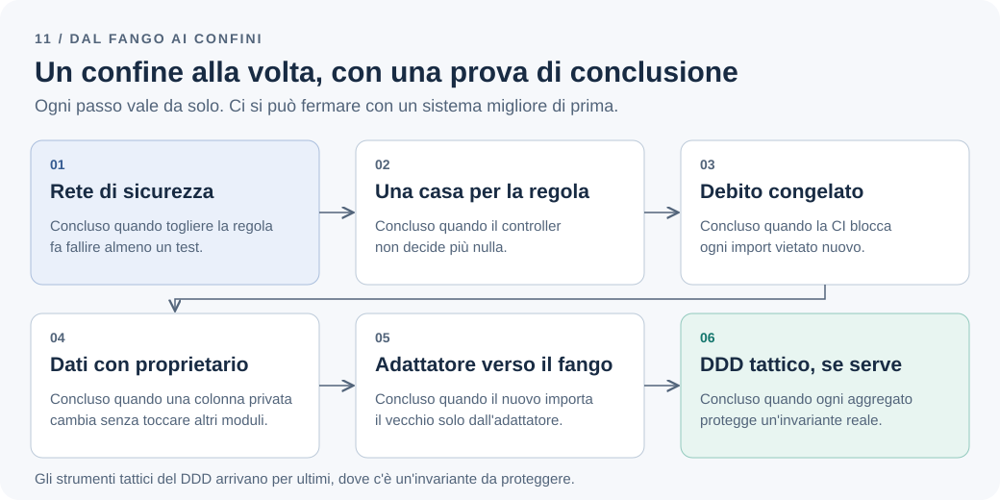

# Dalla palla di fango ai confini espliciti

Il team eredita l'applicazione Todo dopo tre anni di consegne rapide. Una modifica al profilo utente rompe la creazione delle attività. Il limite dei tre todo attivi esiste in due punti, con esiti diversi. Una revisione del codice dura ore perché nessuno sa cosa dipenda da cosa. Sul tavolo c'è una proposta: riscrivere tutto «con il DDD».

Brian Foote e Joseph Yoder hanno chiamato questo stato [big ball of mud](http://www.laputan.org/mud/): un sistema strutturato per convenienza più che per progetto, e diffuso proprio perché funziona. Il fango non è una colpa. È l'esito prevedibile di anni di scelte ragionevoli, prese una alla volta.

**Da dove si comincia a mettere ordine in un sistema che funziona ma che nessuno osa toccare, e fino a dove conviene arrivare?**

## Il problema: cambiare costa e nessuno sa dire perché

Nel codice Todo i sintomi sono concreti. `TodoService` importa `AccountRepository` e aggiorna direttamente le colonne degli utenti. Il controllo sui tre todo attivi vive nel controller HTTP e, in una versione diversa, in un job notturno di importazione. I test passano, ma non dicono se una modifica è sicura.

Le cartelle `domain/` e `infrastructure/` esistono già. Il costo non viene dall'assenza di pattern, ma dall'assenza di confini: nessuna dipendenza è vietata, quindi ogni dipendenza è possibile. Il [capitolo sul monolite modulare](modular-monolith.md#le-cartelle-non-bastano) spiega perché le cartelle, da sole, non bastano.

Prima di intervenire conviene distinguere tre situazioni. Codice che cambia spesso e fa male ogni volta. Codice stabile che nessuno tocca da anni. Codice destinato a essere sostituito. Solo il primo giustifica il lavoro descritto qui.

## La soluzione più semplice: misurare prima di riorganizzare

Un refactoring senza misura parte dal codice più brutto, non da quello più costoso. La storia dei commit dice quali file cambiano insieme; il registro dei difetti dice dove nascono i problemi; un elenco dei punti d'ingresso reali (HTTP, CLI, importazioni, job) dice quanti percorsi attraversano la stessa regola.

Il codice che non cambia mai non si tocca: riorganizzarlo è costo senza beneficio. È lo stesso principio del [capitolo sui costi operativi](distributed-systems-cost.md#la-soluzione-più-semplice-migliorare-ciò-che-esiste): migliorare ciò che esiste prima di sostituirlo.

Il risultato è un elenco corto di zone calde, ciascuna con la regola di business che dovrebbe proteggere. Nel nostro caso: creazione e riapertura dei todo, con il limite dei tre attivi.

## Un percorso a passi, ciascuno con una fine riconoscibile

Ogni passo ha valore da solo e una condizione di conclusione che si verifica, non che si percepisce. Ci si può fermare a qualunque punto con un sistema migliore di prima.



*Figura 1 — La mappa del percorso: ogni passo si chiude con una verifica e gli strumenti del DDD arrivano per ultimi.*

### 1. Una rete di sicurezza attorno alle regole

I *test di caratterizzazione* documentano ciò che il sistema fa davvero, non ciò che vorremmo facesse. Michael Feathers, che ha introdotto il termine in *Working Effectively with Legacy Code*, lo spiega in [Characterization Testing](https://michaelfeathers.silvrback.com/characterization-testing): se non è chiaro che un comportamento sia un difetto, il test resta e si parla con gli utenti.

Il primo oggetto è la regola dei tre todo, esercitata da **tutti** gli ingressi, compresa l'importazione che oggi la aggira. La [tabella di esempi del primo capitolo](business-before-architecture.md#rendere-la-comprensione-verificabile) diventa il test, riga per riga e ingresso per ingresso:

```ts
// test/characterization/active-todo-limit.spec.ts
const entryPoints = {
  http: (ownerId: string) => api.post("/todos", { ownerId, title: "t" }),
  import: (ownerId: string) => importer.run([{ ownerId, title: "t" }]),
};

describe.each(Object.entries(entryPoints))("ingresso %s", (_, createTodo) => {
  it("non supera i tre todo attivi", async () => {
    const ownerId = await givenOwnerWithActiveTodos(3);
    await createTodo(ownerId).catch(() => undefined); // l'esito lo dice il conteggio
    expect(await countActive(ownerId)).toBe(3);
  });
});
```

`api`, `importer` e gli helper sono illustrativi. Sul codice attuale il test dell'ingresso HTTP passa e quello dell'importazione fallisce: quel fallimento è la scoperta, da portare al cliente. Se conferma che il limite vale anche lì, il passo 2 farà passare il test; se decide altrimenti, cambiano l'attesa e la tabella del primo capitolo. Lo decide il cliente, non il refactoring.

Passo concluso quando ogni percorso che può aumentare i todo attivi ha un test, e togliere la regola ne fa fallire almeno uno.

### 2. Una sola casa per ogni regola

La regola viene estratta in un caso d'uso chiamato da tutti gli ingressi: una funzione come `assertCanActivate`, un errore di dominio che non conosce HTTP e il protocollo di coordinamento per utente. Niente aggregati, per ora. Il modo è quello dei capitoli su [dove vive la regola](modular-monolith.md#dove-vive-la-regola-dei-tre-todo-attivi) e su [un errore significativo](domain-http-error-mapping.md#la-soluzione-più-semplice-un-errore-significativo).

Il controller smette di decidere: invoca il caso d'uso e [traduce l'esito](domain-http-error-mapping.md#un-esempio-tradurre-al-confine-http). La trappola è spostare la regola in una classe dentro `domain/` che continua a importare l'ORM: conta la direzione delle dipendenze, non il nome della cartella.

Passo concluso quando cancellare il controllo nel controller non fa passare il quarto todo, perché il caso d'uso lo rifiuta comunque.

### 3. Congelare il debito, vietare quello nuovo

Le dipendenze vietate esistono già a decine e renderle bloccanti fermerebbe il lavoro. dependency-cruiser permette di registrarle come *violazioni note* e di fallire soltanto su quelle nuove:

```sh
depcruise --config .dependency-cruiser.cjs --baseline src
depcruise --config .dependency-cruiser.cjs --ignore-known --output-type err src
```

Il primo comando salva le violazioni presenti in `.dependency-cruiser-known-violations.json`; il secondo le ignora e blocca la CI su ogni violazione nuova. Con `--baseline-mode shrink-only` il file può solo accorciarsi. Ho provato la sequenza con dependency-cruiser 18.4.0: due violazioni note ignorate, un import vietato aggiunto subito dopo segnalato.

```text
Violazione presente oggi      →  registrata nella baseline  →  ignorata dalla CI
Violazione introdotta domani  →  assente dalla baseline     →  la CI fallisce
Violazione corretta           →  tolta con shrink-only      →  la baseline si accorcia
```

Le regole sono quelle del [capitolo sui test architetturali](architecture-boundary-tests.md#introdurre-le-regole-in-un-progetto-esistente): poche all'inizio, ogni eccezione con un responsabile e una condizione di rimozione, nessuna esclusione generica di `legacy/`.

Passo concluso quando la CI fallisce su un import vietato introdotto apposta, e il file delle eccezioni è versionato e si accorcia a ogni iterazione.

### 4. Un proprietario ai dati, un modulo alla volta

Il primo modulo è la zona calda più piccola con una regola chiara: Todo, non Account. Riceve un `public.ts` e gli accessi diretti dagli altri moduli passano da lì, come nell'[esempio Account e Todo](modular-monolith.md#un-esempio-account-e-todo).

Le query che attraversavano i moduli non spariscono: vanno scelte tra chiamata batch, copia locale e vista dichiarata, le [tre opzioni del capitolo sul monolite](modular-monolith.md#e-le-letture-che-attraversano-i-moduli). Tabelle e migrazioni ricevono un proprietario, altrimenti [il database aggira il confine](bounded-contexts.md#il-database-può-aggirare-il-confine).

Passo concluso quando rinominare una colonna privata del modulo non richiede modifiche fuori dal modulo.

### 5. Proteggersi da ciò che resta nel fango

Account resta com'è. Il modulo nuovo non lo importa: dipende da un adattatore che traduce il linguaggio vecchio in quello nuovo, una *anti-corruption layer* nel senso della [documentazione Microsoft](https://learn.microsoft.com/en-us/azure/architecture/patterns/anti-corruption-layer), cioè una facciata tra sottosistemi che non condividono la stessa semantica. L'esempio è quello di [dipendere da ciò che serve](bounded-contexts.md#un-esempio-dipendere-da-ciò-che-serve).

La sostituzione del resto, se e quando servirà, è graduale. Nello [Strangler Fig](https://martinfowler.com/bliki/StranglerFigApplication.html) Martin Fowler insiste che investimento e ritorno devono avvenire gradualmente e visibilmente, e riporta le quattro attività di Cartwright, Horn e Lewis: capire gli esiti voluti, spezzare il problema, consegnare le parti, cambiare l'organizzazione perché possa continuare.

Passo concluso quando il codice nuovo importa dal vecchio soltanto attraverso l'adattatore, e l'adattatore ha un test di contratto.

### 6. Solo ora, se serve, gli strumenti tattici del DDD

Aggregati, value object e domain event entrano dove c'è un'invariante da proteggere o un concetto che il codice esprime male. L'insieme dei todo attivi di un proprietario è un aggregato sensato, perché protegge davvero il limite: il [capitolo sulle transazioni](transactions-eventual-consistency.md#aggregati-e-transazioni-non-coincidono-per-definizione) mostra il ragionamento. Un `TodoTitle` che avvolge una stringa senza alcuna regola è solo un tipo in più.

Molte parti del sistema resteranno CRUD, ed è corretto così. Il DDD tattico si applica al [sottodominio core](bounded-contexts.md#dominio-sottodominio-e-confine-del-modello), non all'intero repository.

## Quando non farlo

Se il sistema verrà dismesso entro un orizzonte noto, il risanamento è spesa senza ritorno. Fowler, in [Sacrificial Architecture](https://martinfowler.com/bliki/SacrificialArchitecture.html), ricorda che spesso il miglior codice che possiamo scrivere ora è codice che butteremo via tra qualche anno: meglio dichiararlo che risanare a metà.

Se non si riesce a scrivere i test del primo passo senza cambiare il codice, il primo lavoro è rendere testabile, non riorganizzare.

La riscrittura totale va trattata come una decisione di prodotto con costi espliciti, non come un'opzione tecnica: il codice vecchio contiene regole che nessuno ricorda e che riemergeranno come difetti del sistema nuovo.

Se il team cambierà prima di finire, un percorso a passi conserva valore anche fermandosi al terzo; una riscrittura interrotta a metà no.

## I compromessi e la decisione

Il percorso rende le decisioni verificabili: test, CI e proprietà dei dati sostituiscono le conversazioni. In cambio è lento e poco visibile per chi guarda solo le funzionalità, e per mesi convivono due stili nello stesso repository. Senza l'elenco delle eccezioni mantenuto con disciplina, la convivenza diventa il nuovo fango.

Per l'applicazione Todo non riscriviamo. Applichiamo i passi da uno a quattro al modulo Todo, in ordine, misurando prima e dopo la frequenza dei difetti nelle zone calde e il tempo di una modifica tipica. Account resta dietro un adattatore finché non produce un dolore misurato. Gli strumenti tattici del DDD entrano soltanto per il limite dei tre attivi.

Rivedremo la decisione se le zone calde si spostano, se il numero delle eccezioni non scende per due iterazioni di seguito, o se emerge una regola di business che il modello attuale non sa esprimere.

**Il fango non si toglie scegliendo un pattern.** Si toglie un confine alla volta, con un test che dice cosa cambia e una regola in CI che impedisce di tornare indietro. Il DDD serve dove c'è un'invariante da proteggere; altrove è un costo.

---

[Capitolo precedente: I microservizi sono anche una decisione operativa](distributed-systems-cost.md)

[Torna all'indice dei capitoli](../README.md#capitoli)
