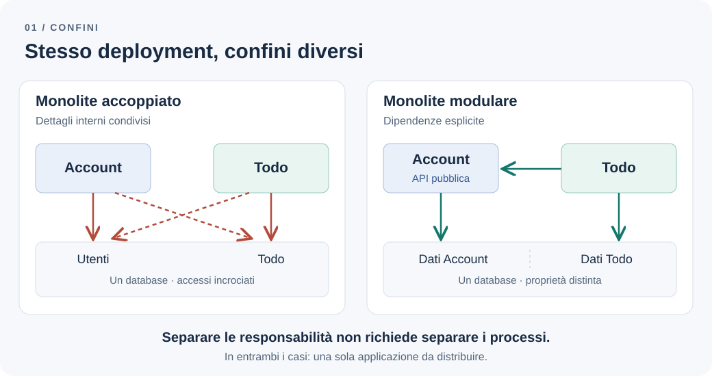
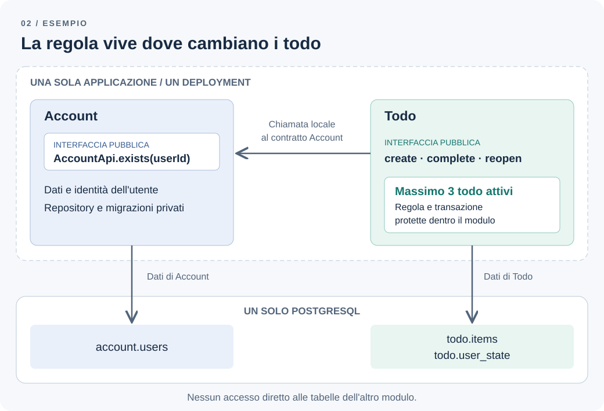

# Quando basta un monolite modulare

Un'applicazione cresce. Una modifica al profilo utente rompe la creazione dei todo; una nuova regola sui todo richiede di intervenire anche nel codice degli account. Le funzionalità diventano più difficili da cambiare e il team comincia a parlare di microservizi.

Prima di separare i processi, però, conviene capire quale problema stiamo cercando di risolvere. Se il codice conosce troppi dettagli delle altre funzionalità, spostarlo dietro una chiamata HTTP non elimina automaticamente quelle dipendenze.

**Ci servono servizi indipendenti oppure confini più chiari dentro la stessa applicazione?**

## Il problema: modifiche che si propagano

Consideriamo un'applicazione Todo, mantenuta da un solo team e basata su PostgreSQL. La gestione degli account possiede i dati degli utenti; la gestione dei todo ne governa creazione, completamento e riapertura. La regola di business è semplice: **un utente non può avere più di tre todo attivi**.

All'inizio tutto è vicino e facile da raggiungere. Il codice dei todo legge direttamente la tabella degli utenti. Il codice degli account aggiorna i todo tramite un repository condiviso. Il controllo sul numero di attività compare nel controller HTTP, ma un'importazione batch lo aggira.

Ora cambiare una tabella o una regola richiede di cercare tutti i punti che potrebbero dipenderne. Il problema è l'accoppiamento: responsabilità e dettagli interni sono distribuiti in parti dell'applicazione che dovrebbero poter evolvere separatamente.

Il team, invece, riesce ancora a rilasciare insieme. Non ci sono carichi che richiedano capacità di calcolo dedicate a una singola funzionalità. Un solo deployment non è, per il momento, il collo di bottiglia.

## La soluzione più semplice: confini espliciti

Un monolite modulare mantiene un'unica applicazione distribuibile, ma organizza il codice in moduli con responsabilità e interfacce definite. Nell'esempio, Account e Todo rimangono nello stesso processo e condividono un database PostgreSQL.



*Figura 1 — Il deployment resta unico. Cambiano le dipendenze consentite e la proprietà dei dati.*

Ogni modulo espone le operazioni che gli altri possono usare e mantiene privati repository, entità di persistenza e dettagli implementativi. Account decide come rappresentare un utente. Todo decide cosa significhi avere un'attività attiva e quando sia possibile crearne un'altra.

Anche tabelle e migrazioni hanno un proprietario. Il modulo Todo può usare un identificativo utente, ma non deve conoscere tutte le colonne della tabella Account né aggiornarle direttamente. Se gli serve sapere se un account esiste, lo chiede all'interfaccia pubblica del modulo Account con una chiamata nello stesso processo.

Questo confine consente, per esempio, di riorganizzare la persistenza degli account senza modificare Todo, finché il contratto pubblico rimane stabile. Non elimina tutte le dipendenze: le rende esplicite e più piccole.

### Le cartelle non bastano

Spostare i file in `account/` e `todo/` aiuta a orientarsi, ma non impedisce a Todo di importare `account/internal/repository`. Il confine deve essere verificabile: un punto d'ingresso pubblico per modulo, regole sugli import eseguite in CI e controlli che impediscano dipendenze circolari.

La stessa attenzione serve per i dati. Schemi PostgreSQL separati possono rendere visibile la proprietà, ma non bloccano gli accessi se l'applicazione usa credenziali con permessi su tutto. Le regole del codice e la revisione delle query restano necessarie; quando occorre una barriera più forte, si possono valutare ruoli e permessi dedicati.

## Un esempio: Account e Todo

Il modulo Account espone un contratto piccolo. Il modulo Todo espone i propri casi d'uso. In TypeScript, le superfici pubbliche potrebbero essere queste:

```ts
// account/public.ts
export interface AccountApi {
  exists(userId: string): Promise<boolean>;
}

// todo/public.ts
export interface TodoApi {
  create(input: { userId: string; title: string }): Promise<{ id: string }>;
  complete(todoId: string): Promise<void>;
  reopen(todoId: string): Promise<void>;
}
```

Sono contratti illustrativi: autenticazione, autorizzazione e gestione degli errori non sono rappresentate. L'interfaccia TypeScript, da sola, non impone il confine; sono l'organizzazione delle dipendenze e i controlli sugli import a sostenerlo.

Il caso d'uso di creazione riceve un'implementazione di `AccountApi`, verifica l'esistenza dell'utente e affida al modulo Todo il rispetto del limite. Non riceve il repository di Account né una sua entità ORM.



*Figura 2 — Le frecce indicano chiamate o accessi ai dati. Il limite sui todo rimane nel modulo che possiede il loro ciclo di vita.*

Il controllo di esistenza è una lettura puntuale: non garantisce che l'account non venga cancellato subito dopo. Se il prodotto prevede la cancellazione degli utenti, bisogna definirne il coordinamento con Todo. Un eventuale vincolo referenziale tra moduli è una scelta esplicita di accoppiamento nello schema, da valutare insieme alle esigenze di integrità.

### Dove vive la regola dei tre todo attivi

La regola appartiene a Todo e deve valere per ogni operazione che aumenta il numero di attività attive, comprese riaperture e importazioni. Metterla soltanto nel controller HTTP lascia scoperti gli altri punti d'ingresso.

Nemmeno una transazione che esegue un semplice conteggio seguito da un inserimento è sufficiente, con il consueto livello di isolamento `READ COMMITTED`: due richieste possono contare entrambe due todo attivi e inserirne uno ciascuna, arrivando a quattro. Ogni comando vede uno snapshot dei dati già confermati. Si veda la [documentazione PostgreSQL sull'isolamento delle transazioni](https://www.postgresql.org/docs/18/transaction-iso.html#XACT-READ-COMMITTED).

Una possibile implementazione mantiene in `todo.user_state` una riga stabile per utente, inizializzata in modo sicuro prima dell'uso e con `user_id` univoco. Nella stessa transazione `READ COMMITTED`, il modulo:

1. Blocca quella riga con `SELECT … FOR UPDATE`.
2. Esegue un comando successivo per contare i todo attivi.
3. Rifiuta l'operazione se il limite è raggiunto; altrimenti inserisce o riapre il todo e conferma la transazione.

Il lock dura fino alla fine della transazione e fa attendere le altre operazioni che acquisiscono lo stesso lock. Tutti i percorsi che possono aumentare il conteggio devono rispettare questo protocollo, anche quando l'applicazione gira su più repliche. Bloccare solo i todo esistenti non offre lo stesso punto di coordinamento, soprattutto quando non ce ne sono. Il comportamento dei lock è descritto nella [documentazione PostgreSQL sui lock di riga](https://www.postgresql.org/docs/18/explicit-locking.html#LOCKING-ROWS).

La riga di coordinamento appartiene a Todo: non serve usare la tabella degli account per proteggere una regola di un altro modulo. Il prezzo è serializzare queste operazioni per lo stesso utente. Per verificarne il comportamento, un test d'integrazione significativo parte da due todo attivi e tenta due creazioni concorrenti: una sola deve riuscire.

## Quando il monolite modulare aiuta

Questa soluzione è adatta quando le funzionalità hanno responsabilità distinguibili, ma il team trae ancora vantaggio da un rilascio comune. Consente di lavorare su una parte del sistema attraverso contratti stabili, mantenendo semplici avvio locale, comunicazione e gestione operativa.

Può ospitare più *bounded context*: ambiti nei quali termini e modelli hanno un significato coerente. Un confine di modello, però, non impone un confine di deployment. Inoltre, non ogni modulo è automaticamente un bounded context: alcuni moduli servono soltanto a organizzare il codice all'interno dello stesso modello.

Il criterio pratico è la capacità di cambiare un'implementazione senza costringere gli altri moduli a conoscerne i dettagli. Se ogni modifica richiede di aggiornare molti contratti, occorre rivedere i confini o le responsabilità.

## Quando diventa complessità inutile

Una piccola applicazione CRUD può funzionare bene con pochi componenti chiari. Creare un modulo per ogni tabella, introdurre interfacce senza un confine da proteggere o aggiungere livelli che si limitano a inoltrare chiamate aumenta il costo di lettura e modifica.

Anche broker, bus di eventi generici e database separati richiedono una motivazione propria. Una chiamata diretta tra moduli è spesso sufficiente. Se si introduce comunicazione asincrona, bisogna accettare e gestire ritardi, errori e consistenza dei dati: la modularità, da sola, non la richiede.

Conviene iniziare dai punti in cui le modifiche si propagano davvero e rendere quei confini più solidi. Non serve anticipare l'infrastruttura di un sistema distribuito per prepararsi a un'estrazione che potrebbe non avvenire.

## I compromessi da accettare

| Aspetto | Cosa otteniamo | Cosa rimane condiviso o da gestire |
| --- | --- | --- |
| Rilascio | Un solo artefatto da distribuire | I moduli vengono rilasciati insieme |
| Comunicazione | Chiamate nello stesso processo | I contratti vanno mantenuti e le dipendenze controllate |
| Dati | Un database da gestire, con proprietà esplicita | Gli accessi diretti tra moduli possono erodere i confini |
| Scalabilità | Possibilità di replicare l'applicazione | Si scala l'intera applicazione, non un singolo modulo |
| Affidabilità | Meno componenti operativi | Un guasto al processo o l'esaurimento delle risorse può coinvolgere tutti i moduli |

Un monolite modulare offre separazione nel codice, ma non l'isolamento operativo di processi distinti. È un compromesso sensato finché i benefici del deployment comune superano i suoi limiti.

## La decisione e i segnali per rivederla

Per questa applicazione scegliamo un monolite modulare: un team, un deployment, PostgreSQL condiviso, interfacce pubbliche piccole e proprietà esplicita di tabelle e migrazioni. Il problema osservato è l'accoppiamento tra funzionalità, quindi interveniamo prima su quello.

Rivedremo la decisione in presenza di esigenze concrete:

- I rilasci comuni provocano attese frequenti tra team che devono lavorare autonomamente.
- Un modulo ha un carico molto diverso e replicare tutta l'applicazione diventa troppo costoso.
- Un requisito di disponibilità richiede che il guasto di una funzionalità non coinvolga le altre.
- La responsabilità di una capacità passa a un team che necessita anche di autonomia operativa.

Questi segnali giustificano una valutazione, non rendono automatica l'estrazione. Separare un servizio introduce chiamate di rete che possono fallire, contratti da far evolvere tra versioni diverse, coordinamento dei dati e nuovi componenti da monitorare. Confini già chiari aiutano, ma l'estrazione richiede comunque lavoro.

**Confini solidi non richiedono servizi separati.** Un monolite modulare può essere una soluzione duratura: scegliamo il deployment in base ai vincoli reali dell'applicazione e cambiamolo quando il beneficio atteso giustifica il costo.

---

[Capitolo precedente: Prima dell'architettura: capire il problema di business](business-before-architecture.md)

[Torna all'indice dei capitoli](../README.md#capitoli)
