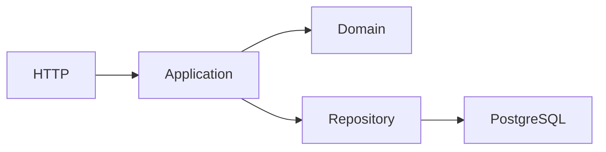

# Software Architecture Notes

## Project Goal

Create a public GitHub repository called:

`software-architecture-notes`

The repository contains short, practical articles about software architecture, Domain-Driven Design, CQRS, distributed systems, and architectural decision-making.

The goal is **not to create an academic architecture handbook**.

The goal is to explain:

- what problem an architectural pattern solves;
- when it makes sense to use it;
- when it introduces unnecessary complexity;
- what trade-offs it introduces;
- how I would make the architectural decision in a real project.

The repository should demonstrate the ability to **reason about architecture and guide technical decisions**, not simply explain patterns.

---

# Target Audience

The primary audience is:

- Senior Developers
- Technical Leads
- Software Architects
- Engineering Managers
- Developers approaching DDD and distributed architectures

Assume the reader already understands basic software development concepts.

Avoid spending too much time explaining basic terminology.

---

# Principles

Every article must follow these principles.

## 1. Problem before pattern

Never start from:

> "CQRS is a pattern that..."

Prefer:

> "The application has a complex write model, while reads require completely different data structures..."

Introduce the problem first and the pattern second.

---

## 2. Prefer the simplest architecture

Complexity must always be justified.

Do not present:

- CQRS
- microservices
- event-driven architecture
- event sourcing
- distributed systems

as automatically better architectures.

Always evaluate whether a simpler solution is sufficient.

---

## 3. Trade-offs over best practices

Avoid statements such as:

> "The best approach is..."

Prefer:

> "This approach is useful when..."

Every architectural decision has costs.

Always make those costs explicit.

---

## 4. Concrete examples

Use small and realistic examples.

Preferred stack for code examples:

- TypeScript
- Node.js
- NestJS
- PostgreSQL
- Drizzle ORM when persistence examples are required

Examples must remain small enough to understand without cloning or running an entire application.

---

## 5. DDD terminology must be precise

Use concepts such as:

- Domain
- Subdomain
- Bounded Context
- Aggregate
- Aggregate Root
- Entity
- Value Object
- Repository
- Domain Service
- Application Service
- Domain Event
- Integration Event
- Policy
- Saga / Process Manager

only when they actually apply.

Do not introduce DDD terminology merely to make an example look more sophisticated.

---

# Reference Domain

When possible, use the same small domain throughout the repository.

Use a Todo application with:

### User

```text
User
- id
- name
- surname
- email
```

### Todo

```text
Todo
- id
- ownerId
- title
- status
```

Business rule:

> A user cannot have more than 3 active todos.

This simple rule can be reused to demonstrate:

- aggregates;
- policies;
- repositories;
- domain events;
- CQRS;
- transactions;
- eventual consistency;
- error mapping;
- outbox;
- integration events.

Other domains may be introduced when the Todo example would make an architectural concept artificial.

---

# Article Structure

Every article should approximately follow this structure.

```markdown
# Title

Short introduction describing the architectural problem.

## The problem

Describe a realistic scenario.

## The simple solution

Explain how the problem could initially be solved without introducing additional architectural complexity.

## When the pattern helps

Describe concrete situations where the pattern becomes useful.

## When it becomes unnecessary complexity

Explain situations where the pattern should probably not be introduced.

## Example

Provide a small TypeScript/NestJS example or architecture diagram.

## Trade-offs

### Benefits

- ...
- ...

### Costs

- ...
- ...

## Decision

Describe what architectural decision would be made in the scenario and why.

## Key takeaway

Summarize the main idea in a few sentences.
```

The structure can be adapted when necessary.

Do not force sections that do not add value.

---

# Writing Style

Articles must be:

- concise;
- practical;
- opinionated only when the opinion is supported by explicit reasoning;
- technically precise;
- easy to scan.

Prefer short paragraphs.

Avoid unnecessary introductions.

Avoid repeating definitions that have already been explained elsewhere.

Typical article length:

**800–1500 words.**

Articles should ideally take approximately **5–10 minutes to read**.

---

# Diagrams

Use Mermaid when a diagram helps explain the architecture.

Example:



Keep diagrams small.

A diagram should explain one architectural idea.

Do not create large enterprise architecture diagrams unless they are necessary.

---

# Repository Structure

Start with:

```text
software-architecture-notes/
│
├── README.md
│
├── articles/
│   ├── modular-monolith.md
│   ├── cqrs-overkill.md
│   ├── domain-vs-integration-events.md
│   ├── outbox-pattern.md
│   ├── bounded-contexts.md
│   ├── domain-http-error-mapping.md
│   ├── architecture-boundary-tests.md
│   ├── transactions-eventual-consistency.md
│   └── distributed-systems-cost.md
│
├── examples/
│   └── todo/
│
└── diagrams/
```

Do not create unnecessary folders before they are needed.

---

# Initial Article Backlog

## Modular Monolith

Working title:

**When a Modular Monolith Is Enough**

Discuss:

- modular monolith vs traditional monolith;
- module boundaries;
- bounded contexts inside one deployment;
- independent modules without independent services;
- database ownership;
- when microservices become justified;
- deployment independence;
- team ownership;
- scaling requirements;
- operational complexity.

Central question:

> Do we actually need independent services, or do we only need strong boundaries?

---

## CQRS

Working title:

**When CQRS Is Overkill**

Discuss:

- CRUD vs CQRS;
- command/query separation;
- same database vs separate read model;
- separate command/query APIs;
- complexity introduced by CQRS;
- eventual consistency;
- operational cost;
- situations where CQRS provides real value.

Central question:

> Is the read/write model actually complex enough to justify CQRS?

Show progressive complexity:

```text
CRUD
  ↓
Logical command/query separation
  ↓
CQRS
  ↓
CQRS + separate read model
  ↓
CQRS + asynchronous projections
```

Explain that these are different levels of architectural commitment.

---

## Domain Event vs Integration Event

Working title:

**Domain Events Are Not Integration Events**

Discuss:

- events generated by the domain;
- events consumed inside the same bounded context;
- events crossing bounded contexts;
- translation between domain and integration events;
- contracts;
- versioning;
- coupling.

Example:

```text
TodoCompleted
      ↓
Domain Event
      ↓
Application
      ↓
TodoCompletedIntegrationEvent
      ↓
Message Broker
```

Central question:

> Should an internal domain concept become a public contract?

---

## Outbox Pattern

Working title:

**Why Saving Data and Publishing an Event Is Hard**

Start from the dual-write problem:

```text
BEGIN TRANSACTION

UPDATE todo

COMMIT

publish(TodoCompleted)
```

Explain what happens when the database succeeds but message publication fails.

Introduce the Outbox Pattern as a solution.

Show:

```text
Transaction
 ├── UPDATE todo
 └── INSERT outbox_event

COMMIT
```

Then:

```text
Outbox Worker
      ↓
Message Broker
```

Discuss:

- atomicity;
- retries;
- duplicate messages;
- idempotency;
- cleanup;
- ordering;
- operational complexity.

Central question:

> How do we reliably connect a database transaction with asynchronous messaging?

---

## Bounded Contexts

Working title:

**Bounded Contexts Are More Than Folders**

Discuss:

- domain vs subdomain vs bounded context;
- model boundaries;
- ownership;
- communication between contexts;
- shared database risks;
- direct imports between modules;
- anti-corruption layers;
- integration events.

Show bad coupling:

```text
Billing
   ↓ direct import
Orders
```

versus explicit communication:

```text
Orders
   ↓
Integration Contract
   ↓
Billing
```

Central question:

> Is the boundary visible and enforceable in the code?

---

## Domain Error → HTTP Error Mapping

Working title:

**Your Domain Should Not Know About HTTP**

Example domain error:

```typescript
class TodoLimitExceeded extends Error {}
```

The domain must not throw:

```typescript
throw new ConflictException();
```

Show the mapping:

```text
Domain
TodoLimitExceeded
        ↓
Application / Presentation mapping
        ↓
HTTP
409 Conflict
```

Discuss:

- domain independence;
- HTTP adapters;
- REST;
- CLI;
- queues;
- tests.

Central question:

> If HTTP disappeared tomorrow, would the domain still make sense?

---

## Architecture Boundary Tests

Working title:

**Testing Architecture, Not Just Business Logic**

Discuss how automated tests can verify architectural rules.

Examples:

```text
Domain cannot import Infrastructure

Domain cannot import NestJS

Application cannot depend on HTTP controllers

Bounded Context A cannot directly import internals from Bounded Context B
```

Show possible TypeScript approaches and small tests.

Central question:

> How do we prevent architectural boundaries from slowly disappearing?

---

## Transactions and Eventual Consistency

Working title:

**Where Should a Transaction End?**

Discuss:

- transaction boundaries;
- aggregate boundaries;
- operations involving multiple aggregates;
- operations involving multiple bounded contexts;
- distributed transactions;
- eventual consistency;
- compensation;
- retries;
- idempotency.

Example:

```text
Create Order
    ↓
Order transaction commits
    ↓
OrderCreated
    ↓
Payment processing
    ↓
Inventory reservation
```

Explain why this is fundamentally different from:

```text
BEGIN

INSERT order
UPDATE inventory
INSERT payment

COMMIT
```

Central question:

> Which operations really need to be immediately consistent?

---

## Operational Cost of Distributed Systems

Working title:

**Microservices Are an Operational Decision Too**

Discuss costs often ignored in architecture diagrams:

- deployments;
- containers;
- orchestration;
- networking;
- observability;
- tracing;
- message brokers;
- retries;
- dead-letter queues;
- service discovery;
- authentication between services;
- secrets;
- CI/CD;
- database ownership;
- migrations;
- incident debugging.

Compare:

```text
Modular Monolith

Application
    ↓
PostgreSQL
```

with:

```text
API Gateway
   ↓
Service A → DB A
   ↓
Broker
   ↓
Service B → DB B
   ↓
Service C → DB C
```

The second architecture may solve important problems, but those benefits must justify its operational cost.

Central question:

> What problem are we solving that is worth paying the distributed-system tax?

---

# Architectural Decision Style

Whenever possible, finish articles with a concrete decision.

Example:

> We have eight developers, six business modules and no requirement for independent deployments. I would start with a modular monolith with explicit module boundaries.
>
> I would extract a service only when a concrete requirement appears, such as independent deployment, independent scaling, stronger isolation or separate team ownership.

The repository should repeatedly demonstrate this reasoning pattern:

```text
Context
   ↓
Problem
   ↓
Constraints
   ↓
Options
   ↓
Trade-offs
   ↓
Decision
```

This is more important than explaining the pattern itself.

---

# README

The root README should clearly explain the purpose of the repository.

Suggested introduction:

> Software Architecture Notes is a collection of short, practical notes about software architecture, DDD, CQRS and distributed systems.
>
> The focus is not on patterns themselves, but on the decisions behind them: when they solve a real problem, when they introduce unnecessary complexity, and what trade-offs they bring.

The README should contain an index linking to every published article.

Do not list unfinished articles as if they were completed.

A separate **Roadmap** section may contain planned articles.

---

# Development Rules for Codex

When adding or modifying content:

1. Keep examples small.
2. Prefer TypeScript.
3. Use NestJS only when framework-specific code adds value.
4. Keep the domain independent from NestJS.
5. Do not introduce infrastructure into domain examples.
6. Clearly distinguish Domain Events from Integration Events.
7. Do not automatically recommend CQRS, microservices or Event Sourcing.
8. Always discuss complexity introduced by a pattern.
9. Prefer diagrams showing boundaries and flows.
10. Keep terminology consistent across articles.
11. Reuse the Todo domain where appropriate.
12. Avoid duplicating explanations across articles; link to related articles instead.
13. Prefer architectural reasoning over framework tutorials.
14. Every article should answer both:
    - **Why would I use this?**
    - **Why would I not use this?**

---

# First Task

Initialize the repository structure.

Create:

- the root `README.md`;
- the `articles/` directory;
- the `examples/` directory;
- the `diagrams/` directory.

Then create the first article:

`articles/modular-monolith.md`

Use the article structure and principles defined above.

The first version should focus on architectural reasoning rather than exhaustive implementation.

Do not generate all articles at once.

Build the repository incrementally, one architectural topic at a time.
